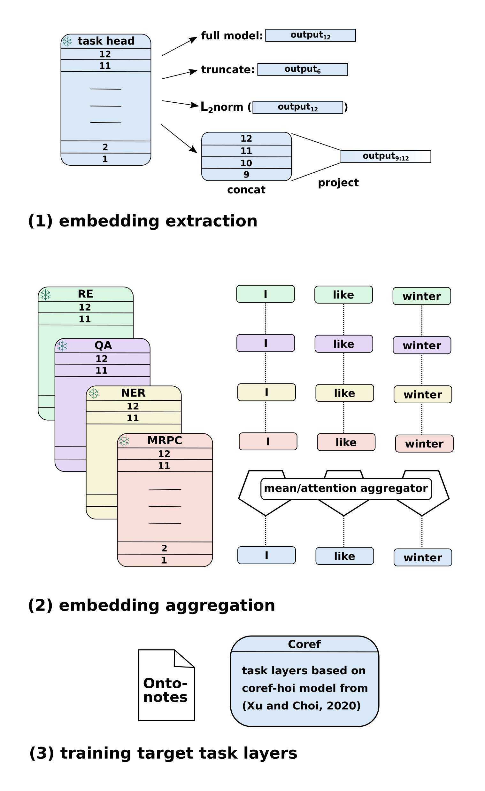

<div align="center">

# Multi-Task Knowledge Transfer

<a href="https://pytorch.org/get-started/locally/"></a>
<a href="https://pytorchlightning.ai/"></a>
<a href="https://hydra.cc/"></a>
<a href="https://github.com/ChristophAlt/pytorch-ie-hydra-template"></a><br>
[](https://arxiv.org/abs/2501.19316)
[](https://sites.google.com/view/repl4nlp2025)

</div>

<p align="center">

</p>

## 📌 Description

This repository contains the code for the experiments described in the
paper [Reverse Probing: Evaluating Knowledge Transfer via Finetuned Task Embeddings for Coreference Resolution (Anikina et al., RepL4NLP 2025)](https://arxiv.org/pdf/2501.19316) that will be presented at the 10th Workshop on Representation Learning for NLP co-located with NAACL 2025 in Albuquerque, New Mexico. See the [official website](https://sites.google.com/view/repl4nlp2025) for more information.

## 📃 Abstract

In this work, we reimagine classical probing to evaluate knowledge transfer from simple source to more complex target tasks. Instead of probing frozen representations from a complex source task on diverse simple target probing tasks (as usually done in probing), we explore the effectiveness of embeddings from multiple simple source tasks on a single target task. We select coreference resolution, a linguistically complex problem requiring contextual understanding, as focus target task, and test the usefulness of embeddings from comparably simpler tasks such as paraphrase detection, named entity recognition, and relation extraction. Through systematic experiments, we evaluate the impact of individual and combined task embeddings.

Our findings reveal that task embeddings vary significantly in utility for coreference resolution, with semantic similarity tasks (e.g., paraphrase detection) proving most beneficial. Additionally, representations from intermediate layers of fine-tuned models often outperform those from final layers. Combining embeddings from multiple tasks consistently improves performance, with attention-based aggregation yielding substantial gains. These insights shed light on relationships between task-specific representations and their adaptability to complex downstream tasks, encouraging further exploration of embedding-level task transfer.

## 🚀 Quickstart

### Environment Setup

```bash
# clone project
git clone https://github.com/Cora4NLP/multi-task-knowledge-transfer
cd multi-task-knowledge-transfer

# [OPTIONAL] create conda environment
conda create -n multi-task-knowledge-transfer python=3.9
conda activate multi-task-knowledge-transfer

# install pytorch according to instructions
# https://pytorch.org/get-started/

# install requirements
pip install -r requirements.txt

# [OPTIONAL] symlink log directories and the default model directory to
# "$HOME/experiments/multi-task-knowledge-transfer" since they can grow a lot
bash setup_symlinks.sh $HOME/experiments/multi-task-knowledge-transfer

# [OPTIONAL] set any environment variables by creating an .env file
# 1. copy the provided example file:
cp .env.example .env
# 2. edit the .env file for your needs!
```

### Data Preparation

#### Relation Extraction

We use the [TACRED dataset](https://nlp.stanford.edu/projects/tacred/).

To use TACRED you have to download it manually. It is available via the LDC
at https://catalog.ldc.upenn.edu/LDC2018T24. Please extract all files in one folder
and set the relevant environment variable: `TACRED_DATA_DIR=[path/to/tacred]/data/json`.

DFKI-internal: On the cluster, use `TACRED_DATA_DIR=/ds/text/tacred/data/json`

#### Named Entity Recognition

We use the [CoNLL 2012 dataset](https://aclanthology.org/W13-3516/), see [here](https://huggingface.co/datasets/conll2012_ontonotesv5) for the HuggingFace Dataset.
Because of license restrictions you need to download the data manually, e.g. from [here](https://data.mendeley.com/public-files/datasets/zmycy7t9h9/files/b078e1c4-f7a4-4427-be7f-9389967831ef/file_downloaded) or from
[here](https://data.mendeley.com/datasets/zmycy7t9h9/2) (the latter requires to unpack the data first to get the
required `conll-2012.zip` file). Then, set the environment variable `CONLL2012_ONTONOTESV5_DATA_DIR` to that
location (either to the extracted folder `conll-2012` or directly to the zip file `conll-2012.zip`).

DFKI-internal: On the cluster, use `CONLL2012_ONTONOTESV5_DATA_DIR=/ds/text/conll-2012`

#### Coreference Resolution

We use the [CoNLL 2012 dataset](https://aclanthology.org/W13-3516/), see [here](https://huggingface.co/datasets/conll2012_ontonotesv5) for the HuggingFace Dataset.

In order to download and prepare the data for coreference resolution you can execute the following script (`scripts/prepare_coref_data.sh`):

```bash
#!/bin/sh

COREF_SCRIPTS_DIR="dataset_builders/pie/conll2012_ontonotesv5_preprocessed"
DATA_DIR="data"
TARGET_DIR="$DATA_DIR/ontonotes_coref"

# download and unpack the data: this will create the directory "$DATA_DIR/conll-2012"
sh $COREF_SCRIPTS_DIR/download_data.sh $DATA_DIR
# combine the annotations and stores them in the conll format
bash $COREF_SCRIPTS_DIR/setup_coref_data.sh $DATA_DIR $TARGET_DIR
# tokenize the input (this requires the Huggingface transformers package!) and convert the files to jsonlines
python $COREF_SCRIPTS_DIR/preprocess.py --input_dir $TARGET_DIR --output_dir $TARGET_DIR/english.384.bert-base-cased --seg_len 384
```

This script will first download the files annotated with coreference from the OntoNotes CoNLL-2012 dataset. You can
also download these data manually from [here](https://data.mendeley.com/datasets/zmycy7t9h9/2) or from
[here](https://data.mendeley.com/public-files/datasets/zmycy7t9h9/files/b078e1c4-f7a4-4427-be7f-9389967831ef/file_downloaded).
Then, the pre-processing step first combines the annotations and stores them in the conll format
(`scripts/setup_coref_data.sh`). Finally, the code in
`dataset_builders/pie/conll2012_ontonotesv5_preprocessed/preprocess.py` converts these files to jsonlines.

The resulting files (training, development and test partitions) will be stored in
`data/english.384.bert-base-cased`. They should be identical to the ones that are stored on the cluster:
`/ds/text/cora4nlp/datasets/ontonotes_coref/english.384.bert-base-cased`.

When the data preparation is finished you can set the environment variable
`CONLL2012_ONTONOTESV5_PREPROCESSED_DATA_DIR` in the `.env` file to the place that contains
`english.384.bert-base-cased` directory.

To run the data preparation code on the DFKI cluster, you can execute the following command
(specifying the partition relevant for your department):

```
$ usrun.sh --output=$PWD/preprocess-coref.out -p RTX3090-MLT --mem=24G scripts/prepare_coref_data.sh &
```

Note that `usrun.sh` script is simply a wrapper for the srun command that loads the corresponding image that already includes all the libraraies installed from `requirements.txt`, you can also load any other image that supports torch, e.g. `IMAGE=/netscratch/enroot/nvcr.io_nvidia_pytorch_23.06-py3.sqsh` and then simply run `pip install -r requirements.txt` to get the same environment on the cluster.

<details>

<summary>Content of the `usrun.sh` script</summary>

```
#!/bin/sh
IMAGE=/netscratch/anikina/updated-mtask-knowledge-transfer.sqsh
srun -K \
  --container-mounts=/netscratch:/netscratch,/ds:/ds,$HOME:$HOME \
  --container-workdir=$HOME \
  --container-image=$IMAGE \
  --ntasks=1 \
  --nodes=1 \
  $*
```

</details>

DFKI-internal: On the cluster, use `CONLL2012_ONTONOTESV5_PREPROCESSED_DATA_DIR=/ds/text/cora4nlp/datasets/ontonotes_coref`

#### Extractive Question Answering

We use the [SQuAD 2.0](https://rajpurkar.github.io/SQuAD-explorer/) dataset for extractive question
answering which is fully accessible as a [HuggingFace Dataset](https://huggingface.co/datasets/squad_v2),
so no additional data preparation is required.

### Model Training

**Have a look into the [train.yaml](configs/train.yaml) config to see all available options.**

Train model with default configuration

```bash
# train on CPU
python src/train.py

# train on GPU
python src/train.py trainer=gpu
```

Execute a fast development run (train for two steps)

```bash
python src/train.py +trainer.fast_dev_run=true
```

Train model with chosen experiment configuration from [configs/experiment/](configs/experiment/)

```bash
python src/train.py experiment=conll2003
```

You can override any parameter from command line like this

```bash
python train.py trainer.max_epochs=20 datamodule.batch_size=64
```

Start multiple runs at once (multirun):

```bash
python src/train.py seed=42,43 --multirun
```

Notes:

- this will execute two experiments (one after the other), one for each seed
- the results will be aggregated and stored in `logs/multirun/`, see the last logging output for the exact path

### Model evaluation

This will evaluate the model on the test set of the chosen dataset using the *metrics implemented within the model*.
See [config/dataset/](configs/dataset/) for available datasets.

**Have a look into the [evaluate.yaml](configs/evaluate.yaml) config to see all available options.**

```bash
python src/evaluate.py dataset=conll2003 model_name_or_path=pie/example-ner-spanclf-conll03
```

Notes:

- add the command line parameter `trainer=gpu` to run on GPU

### Inference

This will run inference on the given dataset and split. See [config/dataset/](configs/dataset/) for available datasets.
The result documents including the predicted annotations will be stored in the `predictions/` directory (exact
location will be printed to the console).

**Have a look into the [predict.yaml](configs/predict.yaml) config to see all available options.**

```bash
python src/predict.py dataset=conll2003 model_name_or_path=pie/example-ner-spanclf-conll03
```

Notes:

- add the command line parameter `+pipeline.device=0` to run the inference on GPU 0

### Evaluate Serialized Documents

This will evaluate serialized documents including predicted annotations (see [Inference](#inference)) using a
*document metric*. See [config/metric/](configs/metric/) for available metrics.

**Have a look into the [evaluate_documents.yaml](configs/evaluate_documents.yaml) config to see all available options**

```bash
python src/evaluate_documents.py metric=f1 metric.layer=entities +dataset.data_dir=PATH/TO/DIR/WITH/SPLITS
```

Note: By default, this utilizes the dataset provided by the
[from_serialized_documents](configs/dataset/from_serialized_documents.yaml) configuration. This configuration is
designed to facilitate the loading of serialized documents, as generated during the [Inference](#inference) step. It
requires to set the parameter `data_dir`. If you want to use a different dataset,
you can override the `dataset` parameter as usual with any existing dataset config, e.g `dataset=conll2003`. But
calculating the F1 score on the bare `conll2003` dataset does not make much sense, because it does not contain any
predictions. However, it could be used with statistical metrics such as
[count_text_tokens](configs/metric/count_text_tokens.yaml) or
[count_entity_labels](configs/metric/count_entity_labels.yaml).

## Pre-trained Models

### Coreference

The pre-trained coreference model in `models/pretrained/bert-base-cased-coref-hoi` is trained on the CoNLL2012 [OntoNotes 5.0](https://catalog.ldc.upenn.edu/LDC2013T19) data using the official code from the [coref-hoi repository](https://github.com/lxucs/coref-hoi/) as follows:

```bash
python run.py bert_base 0
```

`bert_base` is the configuration defined below and 0 is the gpu id.

```bash
bert_base = ${best}{
  num_docs = 2802
  trn_data_path = /ds/text/ontonotes_coref/seg_len_384/train.english.384.jsonlines
  dev_data_path = /ds/text/ontonotes_coref/seg_len_384/dev.english.384.jsonlines
  tst_data_path = /ds/text/ontonotes_coref/seg_len_384/test.english.384.jsonlines
  bert_learning_rate = 1e-05
  task_learning_rate = 2e-4
  max_segment_len = 384
  ffnn_size = 3000
  cluster_ffnn_size = 3000
  max_training_sentences = 11
  bert_tokenizer_name = bert-base-cased
  bert_pretrained_name_or_path = bert-base-cased
}
```

The `bert_base` configuration refers to the `best` configuration which specifies additional parameters, it is defined in the coref-hoi repository: [https://github.com/lxucs/coref-hoi/blob/master/experiments.conf](https://github.com/lxucs/coref-hoi/blob/master/experiments.conf)

## Development

```bash
# run pre-commit: code formatting, code analysis, static type checking, and more (see .pre-commit-config.yaml)
pre-commit run -a

# run tests
pytest -k "not slow" --cov --cov-report term-missing
```

## How to reproduce our results?

We have performed extensive experiments with different models and configurations. The experiments that are relevant for the paper are summarized in [`results/coref.md`](https://github.com/Cora4NLP/multi-task-knowledge-transfer/blob/main/results/coref.md). Each set of experiments has a link to the log entry that includes the exact command to train a model for each configuration together with the obtained results and links to the W&B project.

For instance, for the experiments with layer truncation with frozen target + frozen MRPC where we truncate only the MRPC model (frozen-target<sub>12</sub> + frozen-MRPC<sub>2</sub>) you can have a look at [the corresponding log entry](https://github.com/Cora4NLP/multi-task-knowledge-transfer/blob/main/log.md#coreference-resolution---frozen-pre-trained-target-model--frozen-mrpc-model-mrpc-truncated-to-2-layers) linked in [this table](https://github.com/Cora4NLP/multi-task-knowledge-transfer/blob/main/results/coref.md#experiments-with-layer-truncation-with-frozen-target--frozen-mrpc-where-we-truncate-only-the-mrpc-model) in `results/coref.md` where you can find the training command and the results:

```
python src/train.py \
experiment=conll2012_coref_hoi_multimodel_base \
+model.pretrained_models={bert-base-cased-coref-hoi:models/pretrained/bert-base-cased-coref-hoi,bert-base-cased-mrpc:bert-base-cased-finetuned-mrpc} \
+model.freeze_models=[bert-base-cased-coref-hoi,bert-base-cased-mrpc] \
+model.aggregate=attention \
model.task_learning_rate=1e-4 \
trainer=gpu \
+model.truncate_models.bert-base-cased-mrpc=2 \
seed=1,2,3 \
+wandb_watch=attention_activation \
+hydra.callbacks.save_job_return.integrate_multirun_result=true \
--multirun
```

## 📃 Citation

```bibtex
@article{Anikina2025ReversePE,
  title={Reverse Probing: Evaluating Knowledge Transfer via Finetuned Task Embeddings for Coreference Resolution},
  author={Tatiana Anikina and Arne Binder and David Harbecke and Stalin Varanasi and Leonhard Hennig and Simon Ostermann and Sebastian Moller and Josef van Genabith},
  journal={ArXiv},
  year={2025},
  volume={abs/2501.19316},
  url={https://api.semanticscholar.org/CorpusID:276079972}
}
```
