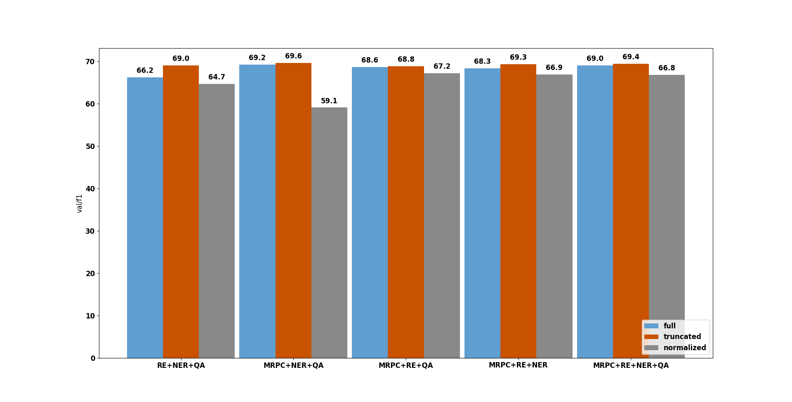

# Coreference Experiments Results

This file replicates the main outcomes from `log.md` and provides the summaries and interpretations of the experiments. It includes all experiments relevant for coreference resolution.

## Experiments with the learning rate

The best result with the maximum val/f1 was achieved with the task learning rate 1e-4. All further experiments use this learning rate (unless otherwise specified).

|       lr |      val/f1 | val/loss |
| -------: | ----------: | -------: |
|     2e-3 |     0.72661 |  389.376 |
|     1e-3 |     0.73031 |  233.430 |
|     2e-4 |       0.735 |  119.975 |
| **1e-4** | **0.73653** |  99.1169 |
|     2e-5 |     0.73101 |  85.9004 |

log entry: [frozen pre-trained target-model + frozen bert (coref learning rate optimization)](https://github.com/Cora4NLP/multi-task-knowledge-transfer/blob/main/log.md#coreference-resolution---frozen-pre-trained-target-model--frozen-bert-learning-rate-optimization)

## Experiments with pre-trained target + another frozen pre-trained model (RE, NER, QA)

**Idea:** check whether having another pre-trained task model together with the frozen target model brings any benefits.

**Findings:** there is no big difference in results, although the combination with SQUAD seems slightly better than the rest (0.739). Interestingly, [(Vu et al., 2022)](https://aclanthology.org/2022.acl-long.346/) also showed that coreference task benefits from the soft prompt transfer when the prompt is pre-trained on the QA task (they showed it for ReCoRD → WSC).

**TODOs:** re-run the experiment for *frozen-target-only* with the optimized learning rate. The [old experiment](https://wandb.ai/tanikina/conll2012-multi_model_coref_hoi-training/runs/7uyjay9c) has best val/f1 0.7367 but it was trained with the default (non-optimized) learning rate 2e-4. Still, combinations with NER, SQUAD and MRPC seem to outperform it slightly.

| setting                      | val/f1   | val/loss | val/f1/std | log entry                                                                                                                                                                                |
| :--------------------------- | :------- | :------- | :--------- | :--------------------------------------------------------------------------------------------------------------------------------------------------------------------------------------- |
| frozen-target + frozen-NER   | 0.73828  | 101.815  | 0.0014     | [2023-10-23](https://github.com/Cora4NLP/multi-task-knowledge-transfer/blob/main/log.md#coreference-resolution---frozen-pre-trained-target-model--frozen-ner-model-learning-rate-1e-4)   |
| frozen-target + frozen-RE    | 0.73660  | 90.403   | 0.00186    | [2023-10-23](https://github.com/Cora4NLP/multi-task-knowledge-transfer/blob/main/log.md#coreference-resolution---frozen-pre-trained-target-model--frozen-re-model-learning-rate-1e-4)    |
| frozen-target + frozen-SQUAD | 0.738545 | 100.612  | 0.00121    | [2023-10-23](https://github.com/Cora4NLP/multi-task-knowledge-transfer/blob/main/log.md#coreference-resolution---frozen-pre-trained-target-model--frozen-squad-model-learning-rate-1e-4) |
| frozen-target + frozen-MRPC  | 0.738308 | 99.4617  | 0.00106    | [2023-10-23](https://github.com/Cora4NLP/multi-task-knowledge-transfer/blob/main/log.md#coreference-resolution---frozen-pre-trained-target-model--frozen-mrpc-model-learning-rate-1e-4)  |

## Experiments with layer truncation with frozen target + frozen MRPC where we truncate only the MRPC model

**Idea:** the last layers of BERT may be over-specialized on the target task and thus not very useful for the target model, we check whether truncating the model to different sizes has any effect.

**Findings:** the results seem to be the same for different number of truncated layers. MRPC truncated to 11 layers shows marginally better performance than the full (non-truncated) model: 0.739 vs 0.738 val/f1. Interestingly, truncating MRPC to only 2 layers brings approximately the same result as when we have the full model. This probably means that having a model pre-trained on the target task makes other models obsolete.

| setting                                               | val/f1   | val/loss | val/f1/std | log entry                                                                                                                                                                                        |
| :---------------------------------------------------- | :------- | :------- | :--------- | :----------------------------------------------------------------------------------------------------------------------------------------------------------------------------------------------- |
| frozen-target12 + frozen-MRPC2  | 0.738888 | 106.188  | 0.00088    | [2023-11-01](https://github.com/Cora4NLP/multi-task-knowledge-transfer/blob/main/log.md#coreference-resolution---frozen-pre-trained-target-model--frozen-mrpc-model-mrpc-truncated-to-2-layers)  |
| frozen-target12 + frozen-MRPC4  | 0.738706 | 96.5667  | 0.00038    | [2023-11-01](https://github.com/Cora4NLP/multi-task-knowledge-transfer/blob/main/log.md#coreference-resolution---frozen-pre-trained-target-model--frozen-mrpc-model-mrpc-truncated-to-4-layers)  |
| frozen-target12 + frozen-MRPC6  | 0.738047 | 101.016  | 0.00463    | [2023-11-01](https://github.com/Cora4NLP/multi-task-knowledge-transfer/blob/main/log.md#coreference-resolution---frozen-pre-trained-target-model--frozen-mrpc-model-mrpc-truncated-to-6-layers)  |
| frozen-target12 + frozen-MRPC8  | 0.737117 | 95.9866  | 0.00230    | [2023-11-01](https://github.com/Cora4NLP/multi-task-knowledge-transfer/blob/main/log.md#coreference-resolution---frozen-pre-trained-target-model--frozen-mrpc-model-mrpc-truncated-to-8-layers)  |
| frozen-target12 + frozen-MRPC10 | 0.737605 | 100.998  | 0.00216    | [2023-11-01](https://github.com/Cora4NLP/multi-task-knowledge-transfer/blob/main/log.md#coreference-resolution---frozen-pre-trained-target-model--frozen-mrpc-model-mrpc-truncated-to-10-layers) |
| frozen-target12 + frozen-MRPC11 | 0.738912 | 105.555  | 0.00255    | [2023-11-01](https://github.com/Cora4NLP/multi-task-knowledge-transfer/blob/main/log.md#coreference-resolution---frozen-pre-trained-target-model--frozen-mrpc-model-mrpc-truncated-to-11-layers) |
| frozen-target12 + frozen-MRPC12 | 0.738308 | 99.4617  | 0.00106    | [2023-10-23](https://github.com/Cora4NLP/multi-task-knowledge-transfer/blob/main/log.md#coreference-resolution---frozen-pre-trained-target-model--frozen-mrpc-model-learning-rate-1e-4)          |

## Experiments with layer truncation with frozen target + frozen MRPC where we truncate both the target and the MRPC model

**Idea:** perhaps combining the final layer representation from the target model with the outputs from earlier layers of the other models is not an optimal strategy. Here we test whether combining representations from the same layer makes any difference.

**Findings:** combining the representations at the same layer does not bring any improvement. In fact, having both models truncated to 6 or 8 layers results in worse performance (this is expected because we reduce the capacity of the model with truncation). However, truncating the models to 11 or 10 layers does not seem to have a large impact, the scores are quite similar to the ones obtained with the full MRPC model (0.738).

**TODOs:** Maybe it's also interesting to check whether we could combine the representations at every layer instead of only the final one.

| setting                                               | val/f1   | val/loss | val/f1/std | log entry                                                                                                                                                                                                  |
| :---------------------------------------------------- | :------- | :------- | :--------- | :--------------------------------------------------------------------------------------------------------------------------------------------------------------------------------------------------------- |
| frozen-target6 + frozen-MRPC6   | 0.684451 | 142.663  | 0.00535    | [2023-11-01](https://github.com/Cora4NLP/multi-task-knowledge-transfer/blob/main/log.md#coreference-resolution---frozen-pre-trained-target-model--frozen-mrpc-model-mrpc-and-coref-truncated-to-6-layers)  |
| frozen-target8 + frozen-MRPC8   | 0.716848 | 201.652  | 0.00233    | [2023-11-01](https://github.com/Cora4NLP/multi-task-knowledge-transfer/blob/main/log.md#coreference-resolution---frozen-pre-trained-target-model--frozen-mrpc-model-mrpc-and-coref-truncated-to-8-layers)  |
| frozen-target10 + frozen-MRPC10 | 0.734252 | 255.228  | 0.00241    | [2023-11-01](https://github.com/Cora4NLP/multi-task-knowledge-transfer/blob/main/log.md#coreference-resolution---frozen-pre-trained-target-model--frozen-mrpc-model-mrpc-and-coref-truncated-to-10-layers) |
| frozen-target11 + frozen-MRPC11 | 0.733886 | 212.317  | 0.00305    | [2023-11-01](https://github.com/Cora4NLP/multi-task-knowledge-transfer/blob/main/log.md#coreference-resolution---frozen-pre-trained-target-model--frozen-mrpc-model-mrpc-and-coref-truncated-to-11-layers) |

## Experiments with frozen BERT + frozen other model

**Idea:** in the previous experiments we used the frozen target model and here we test whether having a simple *bert-base-cased* model can make other pre-trained models more useful for the target task. Otherwise, we may simply overfit to the pre-trained target and discard the inputs from other models.

**Findings:** compared to a setting with only frozen BERT we see an improvement for the combinations with other models. Especially, MRPC seems to be beneficial (0.684 with MRPC vs 0.662 with BERT-only). Combining two BERT models improves the results compared to a single model (0.672 vs. 0.662) but it still slightly underperforms combinations with the other pre-trained models. Also, having four frozen BERT models results in a worse val/f1 score than BERT with frozen NER, RE and SQUAD models (0.672 vs 0.683). However, the difference is very small, around 1%.

| setting                           | val/f1   | val/loss | val/f1/std | log entry                                                                                                                                                  |
| :-------------------------------- | :------- | :------- | :--------- | :--------------------------------------------------------------------------------------------------------------------------------------------------------- |
| frozen-BERT-only                  | 0.661615 | 79.2392  | 0.00220    | [2023-11-10](https://github.com/Cora4NLP/multi-task-knowledge-transfer/blob/main/log.md#coreference-resolution---only-frozen-bert)                         |
| frozen-BERT + frozen-BERT         | 0.67239  | 75.126   | 0.00368    | [2023-11-10](https://github.com/Cora4NLP/multi-task-knowledge-transfer/blob/main/log.md#coreference-resolution---frozen-bert--frozen-bert-model)           |
| frozen-BERT + frozen MRPC         | 0.68387  | 70.611   | 0.00256    | [2023-11-10](https://github.com/Cora4NLP/multi-task-knowledge-transfer/blob/main/log.md#coreference-resolution---frozen-bert--frozen-mrpc-model)           |
| frozen-BERT + frozen-NER          | 0.681783 | 76.8861  | 0.00443    | [2023-11-10](https://github.com/Cora4NLP/multi-task-knowledge-transfer/blob/main/log.md#coreference-resolution---frozen-bert--frozen-ner-model)            |
| frozen-BERT + frozen-RE           | 0.674879 | 76.5669  | 0.00042    | [2023-11-10](https://github.com/Cora4NLP/multi-task-knowledge-transfer/blob/main/log.md#coreference-resolution---frozen-bert--frozen-re-model)             |
| frozen-BERT + frozen-SQUAD        | 0.679109 | 70.7663  | 0.00705    | [2023-11-10](https://github.com/Cora4NLP/multi-task-knowledge-transfer/blob/main/log.md#coreference-resolution---frozen-bert--frozen-squad-model)          |
| frozen-BERT + frozen-BERT-3x      | 0.671762 | 67.3244  | 0.00309    | [2023-11-13](https://github.com/Cora4NLP/multi-task-knowledge-transfer/blob/main/log.md#coreference-resolution---frozen-bert--frozen-bert-3x)              |
| frozen-BERT + frozen-NER-RE-SQUAD | 0.683018 | 65.6854  | 0.00587    | [2023-11-10](https://github.com/Cora4NLP/multi-task-knowledge-transfer/blob/main/log.md#coreference-resolution---frozen-bert--frozen-ner--re--squad-model) |

## Experiments with frozen BERT + frozen other model truncated to 10 layers

**Idea:** combine the frozen BERT output with the representations from the earlier layers of the other models. Here we check whether the results obtained in [the experiments with the frozen target](#experiments-with-layer-truncation-with-frozen-target--frozen-mrpc-where-we-truncate-only-the-mrpc-model) also hold for the frozen BERT.

**Findings:** truncating to 10 layers brings no benefit for NER but gives small improvements for RE (0.683 vs 0.675), SQUAD (0.691 vs 0.679) and MRPC (0.692 vs 0.684). The best performing setting includes frozen BERT and frozen NER-RE-SQUAD where all the other models are truncated to 10 layers. This combination achieves 0.702 val/f1 which is better than BERT-only (0.662), two frozen BERT models (0.672) and four frozen BERT models (0.692) where the target BERT model has 12 layers and three other BERT models are truncated to 10 layers.

| setting                                                                  | val/f1   | val/loss | val/f1/std | log entry                                                                                                                                                               |
| :----------------------------------------------------------------------- | :------- | :------- | :--------- | :---------------------------------------------------------------------------------------------------------------------------------------------------------------------- |
| frozen-BERT + frozen-MRPC10                                   | 0.6924   | 86.3845  | 0.00227    | [2023-11-10](https://github.com/Cora4NLP/multi-task-knowledge-transfer/blob/main/log.md#coreference-resolution---frozen-bert--frozen-mrpc-model-10-truncated)           |
| frozen-BERT + frozen-NER10                                    | 0.68122  | 75.3121  | 0.00226    | [2023-11-10](https://github.com/Cora4NLP/multi-task-knowledge-transfer/blob/main/log.md#coreference-resolution---frozen-bert--frozen-ner-model-10-truncated)            |
| frozen-BERT + frozen-RE10                                     | 0.682553 | 86.9013  | 0.00310    | [2023-11-10](https://github.com/Cora4NLP/multi-task-knowledge-transfer/blob/main/log.md#coreference-resolution---frozen-bert--frozen-re-model-10-truncated)             |
| frozen-BERT + frozen-SQUAD10                                  | 0.690946 | 89.4629  | 0.00706    | [2023-11-10](https://github.com/Cora4NLP/multi-task-knowledge-transfer/blob/main/log.md#coreference-resolution---frozen-bert--frozen-squad-model-10-truncated)          |
| frozen-BERT + frozen-BERT10-3x                                | 0.692258 | 86.5103  | 0.00089    | [2023-11-13](https://github.com/Cora4NLP/multi-task-knowledge-transfer/blob/main/log.md#coreference-resolution---frozen-bert--frozen-bert-3x-10-truncated)              |
| frozen-BERT + frozen-NER10-RE10-SQUAD10 | 0.701959 | 86.4457  | 0.00428    | [2023-11-10](https://github.com/Cora4NLP/multi-task-knowledge-transfer/blob/main/log.md#coreference-resolution---frozen-bert--frozen-ner--re--squad-model-10-truncated) |

## Aggregation experiments

**Idea:** test different ways of aggregating the token embeddings (attention vs mean vs sum).

**Findings:** attention is the clear winner followed by mean and then sum aggregation. Interestingly, the validation loss for sum aggregation is very big (602.827 with frozen-target and 926.887 with frozen BERT) compared to the other methods (e.g., 99.4617 for frozen-target with attention and 70.611 for frozen-target with BERT).

| setting                     | aggregate | val/f1   | val/loss | val/f1/std | log entry                                                                                                                                                                                  |
| :-------------------------- | :-------- | :------- | :------- | :--------- | :----------------------------------------------------------------------------------------------------------------------------------------------------------------------------------------- |
| frozen-target + frozen-MRPC | attn      | 0.738308 | 99.4617  | 0.00106    | [2023-10-23](https://github.com/Cora4NLP/multi-task-knowledge-transfer/blob/main/log.md#coreference-resolution---frozen-pre-trained-target-model--frozen-mrpc-model-learning-rate-1e-4)    |
| frozen-target + frozen-MRPC | mean      | 0.710016 | 165.478  | 0.00488    | [2023-11-16](https://github.com/Cora4NLP/multi-task-knowledge-transfer/blob/main/log.md#coreference-resolution---frozen-pre-trained-target-model--frozen-mrpc-model-with-mean-aggregation) |
| frozen-target + frozen-MRPC | sum       | 0.705211 | 602.827  | 0.00945    | [2023-11-16](https://github.com/Cora4NLP/multi-task-knowledge-transfer/blob/main/log.md#coreference-resolution---frozen-pre-trained-target-model--frozen-mrpc-model-with-sum-aggregation)  |
| frozen-BERT + frozen-MRPC   | attn      | 0.68387  | 70.611   | 0.00256    | [2023-11-10](https://github.com/Cora4NLP/multi-task-knowledge-transfer/blob/main/log.md#coreference-resolution---frozen-bert--frozen-mrpc-model)                                           |
| frozen-BERT + frozen-MRPC   | mean      | 0.632592 | 245.824  | 0.02306    | [2023-11-16](https://github.com/Cora4NLP/multi-task-knowledge-transfer/blob/main/log.md#coreference-resolution---frozen-bert--frozen-mrpc-model-with-mean-aggregation)                     |
| frozen-BERT + frozen-MRPC   | sum       | 0.623386 | 926.887  | 0.01060    | [2023-11-16](https://github.com/Cora4NLP/multi-task-knowledge-transfer/blob/main/log.md#coreference-resolution---frozen-bert--frozen-mrpc-model-with-sum-aggregation)                      |

## Projections ablation experiments

**Idea:** test whether removing key, query and value projections hurts the performance (for attention-based aggregation). We also test different learning rate values for BERT.

**Findings:** when attention uses query, key and value projections lower learning rate (3e-6) leads to better performance (0.7386). For the setting when we do not have any projections 3e-4 and 3e-5 result in the best val/f1 score (0.7395), however the difference is very small compared to other learning rates. Changing BERT learning rate does not seem to have any effect when we do not use any projections. When only the query projection is available the best learning rate is 1e-4 with 0.7401 val/f1 score. Different learning rates do not have much impact on this setting. Finally, if we remove the query projection but leave the key and value projections we get better results with the lower learning rates (e.g., 0.7406 val/f1 with lr 1e-5). This shows that those settings that use more projections need a lower BERT learning rate than the ones that do not use any or only a single one (for the query). However, the final difference in f1 scores is very small and we can achieve almost the same performance with or without projections.

**Setting:** frozen-target + frozen-MRPC with Q, K and V projections

| bert lr | mean val/f1 | mean val/loss |
| ------: | ----------: | ------------: |
|    3e-3 |      0.7002 |       1513.25 |
|    1e-3 |      0.7079 |       82.5408 |
|    3e-4 |      0.7236 |       138.724 |
|    1e-4 |      0.7294 |       102.149 |
|    5e-5 |      0.7332 |       103.068 |
|    3e-5 |      0.7362 |       104.157 |
|    1e-5 |      0.7372 |       89.4812 |
|    3e-6 |  **0.7386** |       92.5998 |
|    1e-6 |      0.7335 |       78.4313 |

log entry: [frozen-MRPC + frozen-BERT (Q, K, V projections)](https://github.com/Cora4NLP/multi-task-knowledge-transfer/blob/main/log.md#bert-lr-tuning-for-coref-frozen-pretrained-coref--frozen-mrpc-attention-aggregation-with-query-key-and-value-projections)

**Setting:** frozen-target + frozen-MRPC without Q, K and V projections

| bert lr | mean val/f1 | mean val/loss |
| ------: | ----------: | ------------: |
|    3e-3 |      0.7370 |       133.257 |
|    1e-3 |      0.7346 |       119.724 |
|    3e-4 |  **0.7395** |       140.255 |
|    1e-4 |      0.7358 |       121.089 |
|    5e-5 |      0.7376 |       124.365 |
|    3e-5 |  **0.7395** |       131.436 |
|    1e-5 |      0.7372 |       121.953 |
|    3e-6 |      0.7388 |       129.290 |
|    1e-6 |      0.7370 |       126.127 |

log entry: [frozen-MRPC + frozen-BERT (no projections)](https://github.com/Cora4NLP/multi-task-knowledge-transfer/blob/main/log.md#bert-lr-tuning-for-coref-frozen-pretrained-coref--frozen-mrpc-attention-aggregation-without-query-key-and-value-projections)

**Setting:** frozen-target + frozen-MRPC with Q projection but w/o K and V projections

| bert lr | mean val/f1 | mean val/loss |
| ------: | ----------: | ------------: |
|    3e-3 |      0.7384 |       136.177 |
|    1e-3 |      0.7382 |       135.014 |
|    3e-4 |      0.7384 |       135.213 |
|    1e-4 |  **0.7401** |       134.469 |
|    5e-5 |      0.7387 |       126.815 |
|    3e-5 |      0.7398 |       128.621 |
|    1e-5 |      0.7357 |       108.715 |
|    3e-6 |      0.7397 |       126.065 |
|    1e-6 |      0.7356 |       113.756 |

log entry: [frozen-MRPC + frozen-BERT (Q projection only)](https://github.com/Cora4NLP/multi-task-knowledge-transfer/blob/main/log.md#bert-lr-tuning-for-coref-frozen-pretrained-coref--frozen-mrpc-attention-aggregation-with-query-projection-but-wo-key-and-value-projections)

**Setting:** frozen-target + frozen-MRPC without Q projection but with K and V projections

| bert lr | mean val/f1 | mean val/loss |
| ------: | ----------: | ------------: |
|    3e-3 |      0.6951 |       569.259 |
|    1e-3 |      0.7067 |       90.8321 |
|    3e-4 |      0.7229 |       146.797 |
|    1e-4 |      0.7305 |       116.805 |
|    5e-5 |      0.7339 |       106.148 |
|    3e-5 |      0.7349 |       100.096 |
|    1e-5 |  **0.7406** |       110.213 |
|    3e-6 |      0.7388 |       94.2387 |
|    1e-6 |      0.7317 |       85.3664 |

log entry: [frozen-MRPC + frozen-BERT (K, V projections only)](https://github.com/Cora4NLP/multi-task-knowledge-transfer/blob/main/log.md#bert-lr-tuning-for-coref-frozen-pretrained-coref--frozen-mrpc-attention-aggregation-without-query-projection-but-with-key-and-value-projections)

## Probing experiments

**Idea:** check whether different pre-trained models work well on the coreference task. Each pre-trained model is frozen and we use mean for embeddings aggregation to avoid introducing additional parameters into the model.

**Findings:** as expected, frozen-target performs the best (0.7375 val/f1). Surprisingly, frozen-NER performs very poorly (only 0.3563 val/f1). Standard BERT (w/o any fine-tuning) gives the best scores among the models that were not fine-tuned on the coreference task (0.6495). Another interesting observation is that having frozen BERT 3 times gives a noticeable drop in performance (almost -3%). This means that we probably introduce some noise when combining embeddings with mean aggregation.

| setting             | val/f1 | val/loss | val/f1/std | log entry                                                                                                                                                    |
| :------------------ | :----- | :------- | :--------- | :----------------------------------------------------------------------------------------------------------------------------------------------------------- |
| frozen-target       | 0.7375 | 117.221  | 0.00291    | [2023-11-27](https://github.com/Cora4NLP/multi-task-knowledge-transfer/blob/main/log.md#coreference-probing---frozen-target-model-with-mean-aggregation)     |
| frozen-MRPC         | 0.6116 | 242.417  | 0.02836    | [2023-11-27](https://github.com/Cora4NLP/multi-task-knowledge-transfer/blob/main/log.md#coreference-probing---frozen-mrpc-model-with-mean-aggregation)       |
| frozen-NER          | 0.3563 | 512.712  | 0.02122    | [2023-11-27](https://github.com/Cora4NLP/multi-task-knowledge-transfer/blob/main/log.md#coreference-probing---frozen-ner-model-with-mean-aggregation)        |
| frozen-RE           | 0.5227 | 691.528  | 0.02390    | [2023-11-27](https://github.com/Cora4NLP/multi-task-knowledge-transfer/blob/main/log.md#coreference-probing---frozen-re-model-with-mean-aggregation)         |
| frozen-SQUAD        | 0.5079 | 577.224  | 0.03011    | [2023-11-27](https://github.com/Cora4NLP/multi-task-knowledge-transfer/blob/main/log.md#coreference-probing---frozen-qa-model-with-mean-aggregation)         |
| frozen-BERT         | 0.6495 | 295.832  | 0.00977    | [2023-11-27](https://github.com/Cora4NLP/multi-task-knowledge-transfer/blob/main/log.md#coreference-probing---frozen-bert-model-with-mean-aggregation)       |
| frozen-NER-RE-SQUAD | 0.5793 | 269.619  | 0.03082    | [2023-11-27](https://github.com/Cora4NLP/multi-task-knowledge-transfer/blob/main/log.md#coreference-probing---frozen-ner-re-qa-models-with-mean-aggregation) |
| frozen-BERT-3x      | 0.6195 | 320.306  | 0.00708    | [2023-11-27](https://github.com/Cora4NLP/multi-task-knowledge-transfer/blob/main/log.md#coreference-probing---frozen-bert-3x-models-with-mean-aggregation)   |

## Probing experiments with truncated models (mean)

**Idea:** do the same as in the [probing experiments above](#probing-experiments) but with the truncated models (6-11 layers).

**Findings:** for the frozen-target setup we have a predictable behaviour with the f1 scores going down from 0.7375 to 0.6723 when we decrease the number of available layers (from 12 to 6). Interestingly, MRPC shows better scores when truncated to layer 8 or 9 (0.6626 val/f1), NER performs very poorly when only the output of the final layer is considered (0.3563 val/f1) but the score increases to 0.6176 when we use the output of the 6th layer. Similarly to MRPC, RE model achieves best performance with the truncation to the 9th layer (0.6240 val/f1). SQUAD shows the same pattern with the difference of +13.98 f1 points when we truncate the model to the first 8 layers. Finally, frozen-BERT has slightly better performance when we truncate the model to the 9th or 10th layer but the difference is smaller than e.g., for SQUAD or NER. The best score is 0.6640 with frozen-BERT10.

### frozen-target

| setting                    | val/f1 | val/loss | val/f1/std | log entry                                                                                                                                                                       |
| :------------------------- | :----- | :------- | :--------- | :------------------------------------------------------------------------------------------------------------------------------------------------------------------------------ |
| frozen-target12 | 0.7375 | 117.221  | 0.00291    | [2023-11-27](https://github.com/Cora4NLP/multi-task-knowledge-transfer/blob/main/log.md#coreference-probing---frozen-target-model-with-mean-aggregation)                        |
| frozen-target11 | 0.7303 | 1137.19  | 0.00482    | [2023-12-04](https://github.com/Cora4NLP/multi-task-knowledge-transfer/blob/main/log.md#coreference-probing---frozen-target-model-with-mean-aggregation-truncated-to-11-layers) |
| frozen-target10 | 0.7251 | 1270.77  | 0.0058     | [2023-12-04](https://github.com/Cora4NLP/multi-task-knowledge-transfer/blob/main/log.md#coreference-probing---frozen-target-model-with-mean-aggregation-truncated-to-10-layers) |
| frozen-target9  | 0.7286 | 1638.51  | 0.0034     | [2023-12-04](https://github.com/Cora4NLP/multi-task-knowledge-transfer/blob/main/log.md#coreference-probing---frozen-target-model-with-mean-aggregation-truncated-to-9-layers)  |
| frozen-target8  | 0.7147 | 1432.39  | 0.00127    | [2023-12-04](https://github.com/Cora4NLP/multi-task-knowledge-transfer/blob/main/log.md#coreference-probing---frozen-target-model-with-mean-aggregation-truncated-to-8-layers)  |
| frozen-target7  | 0.6953 | 1209.98  | 0.0024     | [2023-12-04](https://github.com/Cora4NLP/multi-task-knowledge-transfer/blob/main/log.md#coreference-probing---frozen-target-model-with-mean-aggregation-truncated-to-7-layers)  |
| frozen-target6  | 0.6723 | 1071.08  | 0.00209    | [2023-12-04](https://github.com/Cora4NLP/multi-task-knowledge-transfer/blob/main/log.md#coreference-probing---frozen-target-model-with-mean-aggregation-truncated-to-6-layers)  |

### frozen-MRPC

| setting                  | val/f1 | val/loss | val/f1/std | log entry                                                                                                                                                                     |
| :----------------------- | :----- | :------- | :--------- | :---------------------------------------------------------------------------------------------------------------------------------------------------------------------------- |
| frozen-MRPC12 | 0.6116 | 242.417  | 0.02836    | [2023-11-27](https://github.com/Cora4NLP/multi-task-knowledge-transfer/blob/main/log.md#coreference-probing---frozen-mrpc-model-with-mean-aggregation)                        |
| frozen-MRPC11 | 0.6375 | 797.579  | 0.00082    | [2023-12-04](https://github.com/Cora4NLP/multi-task-knowledge-transfer/blob/main/log.md#coreference-probing---frozen-mrpc-model-with-mean-aggregation-truncated-to-11-layers) |
| frozen-MRPC10 | 0.6524 | 824.06   | 0.01113    | [2023-12-04](https://github.com/Cora4NLP/multi-task-knowledge-transfer/blob/main/log.md#coreference-probing---frozen-mrpc-model-with-mean-aggregation-truncated-to-10-layers) |
| frozen-MRPC9  | 0.6626 | 887.15   | 0.00610    | [2023-12-04](https://github.com/Cora4NLP/multi-task-knowledge-transfer/blob/main/log.md#coreference-probing---frozen-mrpc-model-with-mean-aggregation-truncated-to-9-layers)  |
| frozen-MRPC8  | 0.6613 | 862.599  | 0.00408    | [2023-12-04](https://github.com/Cora4NLP/multi-task-knowledge-transfer/blob/main/log.md#coreference-probing---frozen-mrpc-model-with-mean-aggregation-truncated-to-8-layers)  |
| frozen-MRPC7  | 0.6550 | 886.209  | 0.01268    | [2023-12-04](https://github.com/Cora4NLP/multi-task-knowledge-transfer/blob/main/log.md#coreference-probing---frozen-mrpc-model-with-mean-aggregation-truncated-to-7-layers)  |
| frozen-MRPC6  | 0.6280 | 873.283  | 0.00830    | [2023-12-04](https://github.com/Cora4NLP/multi-task-knowledge-transfer/blob/main/log.md#coreference-probing---frozen-mrpc-model-with-mean-aggregation-truncated-to-6-layers)  |

### frozen-NER

| setting                 | val/f1 | val/loss | val/f1/std | log entry                                                                                                                                                                    |
| :---------------------- | :----- | :------- | :--------- | :--------------------------------------------------------------------------------------------------------------------------------------------------------------------------- |
| frozen-NER12 | 0.3563 | 512.712  | 0.02122    | [2023-11-27](https://github.com/Cora4NLP/multi-task-knowledge-transfer/blob/main/log.md#coreference-probing---frozen-ner-model-with-mean-aggregation)                        |
| frozen-NER11 | 0.5315 | 930.88   | 0.01473    | [2023-12-04](https://github.com/Cora4NLP/multi-task-knowledge-transfer/blob/main/log.md#coreference-probing---frozen-ner-model-with-mean-aggregation-truncated-to-11-layers) |
| frozen-NER10 | 0.5575 | 1043.45  | 0.01816    | [2023-12-04](https://github.com/Cora4NLP/multi-task-knowledge-transfer/blob/main/log.md#coreference-probing---frozen-ner-model-with-mean-aggregation-truncated-to-10-layers) |
| frozen-NER9  | 0.5623 | 1089.59  | 0.02427    | [2023-12-04](https://github.com/Cora4NLP/multi-task-knowledge-transfer/blob/main/log.md#coreference-probing---frozen-ner-model-with-mean-aggregation-truncated-to-9-layers)  |
| frozen-NER8  | 0.5983 | 927.081  | 0.01198    | [2023-12-04](https://github.com/Cora4NLP/multi-task-knowledge-transfer/blob/main/log.md#coreference-probing---frozen-ner-model-with-mean-aggregation-truncated-to-8-layers)  |
| frozen-NER7  | 0.5821 | 919.705  | 0.03259    | [2023-12-04](https://github.com/Cora4NLP/multi-task-knowledge-transfer/blob/main/log.md#coreference-probing---frozen-ner-model-with-mean-aggregation-truncated-to-7-layers)  |
| frozen-NER6  | 0.6176 | 925.745  | 0.01533    | [2023-12-04](https://github.com/Cora4NLP/multi-task-knowledge-transfer/blob/main/log.md#coreference-probing---frozen-ner-model-with-mean-aggregation-truncated-to-6-layers)  |

### frozen-RE

| setting                | val/f1 | val/loss | val/f1/std | log entry                                                                                                                                                                   |
| :--------------------- | :----- | :------- | :--------- | :-------------------------------------------------------------------------------------------------------------------------------------------------------------------------- |
| frozen-RE12 | 0.5227 | 691.528  | 0.02390    | [2023-11-27](https://github.com/Cora4NLP/multi-task-knowledge-transfer/blob/main/log.md#coreference-probing---frozen-re-model-with-mean-aggregation)                        |
| frozen-RE11 | 0.5869 | 997.296  | 0.00706    | [2023-12-04](https://github.com/Cora4NLP/multi-task-knowledge-transfer/blob/main/log.md#coreference-probing---frozen-re-model-with-mean-aggregation-truncated-to-11-layers) |
| frozen-RE10 | 0.5951 | 1053.81  | 0.00167    | [2023-12-04](https://github.com/Cora4NLP/multi-task-knowledge-transfer/blob/main/log.md#coreference-probing---frozen-re-model-with-mean-aggregation-truncated-to-10-layers) |
| frozen-RE9  | 0.6240 | 986.183  | 0.01412    | [2023-12-04](https://github.com/Cora4NLP/multi-task-knowledge-transfer/blob/main/log.md#coreference-probing---frozen-re-model-with-mean-aggregation-truncated-to-9-layers)  |
| frozen-RE8  | 0.6132 | 984.823  | 0.00242    | [2023-12-04](https://github.com/Cora4NLP/multi-task-knowledge-transfer/blob/main/log.md#coreference-probing---frozen-re-model-with-mean-aggregation-truncated-to-8-layers)  |
| frozen-RE7  | 0.6148 | 1001.3   | 0.00371    | [2023-12-04](https://github.com/Cora4NLP/multi-task-knowledge-transfer/blob/main/log.md#coreference-probing---frozen-re-model-with-mean-aggregation-truncated-to-7-layers)  |
| frozen-RE6  | 0.6065 | 996.46   | 0.01435    | [2023-12-04](https://github.com/Cora4NLP/multi-task-knowledge-transfer/blob/main/log.md#coreference-probing---frozen-re-model-with-mean-aggregation-truncated-to-6-layers)  |

### frozen-SQUAD

| setting                   | val/f1 | val/loss | val/f1/std | log entry                                                                                                                                                                      |
| :------------------------ | :----- | :------- | :--------- | :----------------------------------------------------------------------------------------------------------------------------------------------------------------------------- |
| frozen-SQUAD12 | 0.5079 | 577.224  | 0.03011    | [2023-11-27](https://github.com/Cora4NLP/multi-task-knowledge-transfer/blob/main/log.md#coreference-probing---frozen-qa-model-with-mean-aggregation)                           |
| frozen-SQUAD11 | 0.6282 | 931.756  | 0.02304    | [2023-12-04](https://github.com/Cora4NLP/multi-task-knowledge-transfer/blob/main/log.md#coreference-probing---frozen-squad-model-with-mean-aggregation-truncated-to-11-layers) |
| frozen-SQUAD10 | 0.6419 | 935.4    | 0.01579    | [2023-12-04](https://github.com/Cora4NLP/multi-task-knowledge-transfer/blob/main/log.md#coreference-probing---frozen-squad-model-with-mean-aggregation-truncated-to-10-layers) |
| frozen-SQUAD9  | 0.6431 | 937.324  | 0.00303    | [2023-12-04](https://github.com/Cora4NLP/multi-task-knowledge-transfer/blob/main/log.md#coreference-probing---frozen-squad-model-with-mean-aggregation-truncated-to-9-layers)  |
| frozen-SQUAD8  | 0.6477 | 911.96   | 0.00653    | [2023-12-04](https://github.com/Cora4NLP/multi-task-knowledge-transfer/blob/main/log.md#coreference-probing---frozen-squad-model-with-mean-aggregation-truncated-to-8-layers)  |
| frozen-SQUAD7  | 0.6412 | 935.452  | 0.00729    | [2023-12-04](https://github.com/Cora4NLP/multi-task-knowledge-transfer/blob/main/log.md#coreference-probing---frozen-squad-model-with-mean-aggregation-truncated-to-7-layers)  |
| frozen-SQUAD6  | 0.6379 | 920.508  | 0.00702    | [2023-12-04](https://github.com/Cora4NLP/multi-task-knowledge-transfer/blob/main/log.md#coreference-probing---frozen-squad-model-with-mean-aggregation-truncated-to-6-layers)  |

### frozen-BERT

| setting                  | val/f1 | val/loss | val/f1/std | log entry                                                                                                                                                                     |
| :----------------------- | :----- | :------- | :--------- | :---------------------------------------------------------------------------------------------------------------------------------------------------------------------------- |
| frozen-BERT12 | 0.6495 | 295.832  | 0.00977    | [2023-11-27](https://github.com/Cora4NLP/multi-task-knowledge-transfer/blob/main/log.md#coreference-probing---frozen-bert-model-with-mean-aggregation)                        |
| frozen-BERT11 | 0.6353 | 791.918  | 0.00333    | [2023-12-04](https://github.com/Cora4NLP/multi-task-knowledge-transfer/blob/main/log.md#coreference-probing---frozen-bert-model-with-mean-aggregation-truncated-to-11-layers) |
| frozen-BERT10 | 0.6640 | 865.084  | 0.01664    | [2023-12-04](https://github.com/Cora4NLP/multi-task-knowledge-transfer/blob/main/log.md#coreference-probing---frozen-bert-model-with-mean-aggregation-truncated-to-10-layers) |
| frozen-BERT9  | 0.6627 | 864.179  | 0.0079     | [2023-12-04](https://github.com/Cora4NLP/multi-task-knowledge-transfer/blob/main/log.md#coreference-probing---frozen-bert-model-with-mean-aggregation-truncated-to-9-layers)  |
| frozen-BERT8  | 0.6496 | 803.509  | 0.01842    | [2023-12-04](https://github.com/Cora4NLP/multi-task-knowledge-transfer/blob/main/log.md#coreference-probing---frozen-bert-model-with-mean-aggregation-truncated-to-8-layers)  |
| frozen-BERT7  | 0.6499 | 842.642  | 0.01655    | [2023-12-04](https://github.com/Cora4NLP/multi-task-knowledge-transfer/blob/main/log.md#coreference-probing---frozen-bert-model-with-mean-aggregation-truncated-to-7-layers)  |
| frozen-BERT6  | 0.6233 | 807.78   | 0.00955    | [2023-12-04](https://github.com/Cora4NLP/multi-task-knowledge-transfer/blob/main/log.md#coreference-probing---frozen-bert-model-with-mean-aggregation-truncated-to-6-layers)  |

## Comparing the val/f1 scores and loss of the truncated models

[W&B project](https://wandb.ai/tanikina/probing-coref-truncated-models-training)

### 11 layers

### 10 layers

### 9 layers

### 8 layers

### 7 layers

### 6 layers

## Probing experiments with truncated models (mean)

**Idea:** combine the best performing layer for each model with the frozen target and also compare different combinations of truncated models.

**Findings:** adding the target always improves upon the single model but it never reaches the target-only performance with val/f1 0.73. Combining several truncated models with the mean aggregation probably introduces additional noise and makes the performance worse. E.g., frozen-target + frozen-BERT10 achieves 0.7028 val/f1 but when the combination includes multiple models (frozen-target + frozen-BERT10 + frozen-MRPC9 + frozen-RE9 + frozen-NER6 + frozen-SQUAD8) we get only 0.6765 val/f1 and without target it is only 0.6558.

### Truncated models with target (coreference) model

| setting                                                                                                                                        | val/f1 | val/loss | val/f1/std | log entry                                                                                                                                                                                                                              |
| :--------------------------------------------------------------------------------------------------------------------------------------------- | :----- | :------- | :--------- | :------------------------------------------------------------------------------------------------------------------------------------------------------------------------------------------------------------------------------------- |
| frozen-target + frozen-MRPC9                                                                                                        | 0.7003 | 360.775  | 0.00245    | [2023-12-11](https://github.com/Cora4NLP/multi-task-knowledge-transfer/blob/main/log.md#coreference-probing---frozen-mrpc-truncated-to-9-layers---frozen-target-model-with-mean-aggregation)                                           |
| frozen-target + frozen-NER6                                                                                                         | 0.6868 | 346.446  | 0.00730    | [2023-12-11](https://github.com/Cora4NLP/multi-task-knowledge-transfer/blob/main/log.md#coreference-probing---frozen-ner-truncated-to-6-layers---frozen-target-model-with-mean-aggregation)                                            |
| frozen-target + frozen-RE9                                                                                                          | 0.6901 | 378.793  | 0.00652    | [2023-12-11](https://github.com/Cora4NLP/multi-task-knowledge-transfer/blob/main/log.md#coreference-probing---frozen-re-truncated-to-9-layers---frozen-target-model-with-mean-aggregation)                                             |
| frozen-target + frozen-SQUAD8                                                                                                       | 0.6954 | 363.662  | 0.00214    | [2023-12-11](https://github.com/Cora4NLP/multi-task-knowledge-transfer/blob/main/log.md#coreference-probing---frozen-squad-truncated-to-8-layers---frozen-target-model-with-mean-aggregation)                                          |
| frozen-target + frozen-BERT10                                                                                                       | 0.7028 | 368.949  | 0.00818    | [2023-12-11](https://github.com/Cora4NLP/multi-task-knowledge-transfer/blob/main/log.md#coreference-probing---frozen-bert-truncated-to-10-layers---frozen-target-model-with-mean-aggregation)                                          |
| frozen-target + frozen-MRPC9 + frozen-RE9 + frozen-NER6 + frozen-SQUAD8                            | 0.6739 | 547.802  | 0.00989    | [2023-12-04](https://github.com/Cora4NLP/multi-task-knowledge-transfer/blob/main/log.md#coreference-probing---frozen-mrpc-10-layers-re-9-layers-ner-6-layers-squad-8-layers---frozen-target-model-with-mean-aggregation)               |
| frozen-target + frozen-BERT10 + frozen-MRPC9 + frozen-RE9 + frozen-NER6 + frozen-SQUAD8 | 0.6765 | 587.837  | 0.00305    | [2023-12-04](https://github.com/Cora4NLP/multi-task-knowledge-transfer/blob/main/log.md#coreference-probing---frozen-bert-10-layers-mrpc-9-layers-re-9-layers-ner-6-layers-squad-8-layers---frozen-target-model-with-mean-aggregation) |
| frozen-target + frozen-MRPC9 + frozen-SQUAD8                                                                             | 0.6819 | 467.037  | 0.01086    | [2023-12-04](https://github.com/Cora4NLP/multi-task-knowledge-transfer/blob/main/log.md#coreference-probing---frozen-mrpc-9-layers-squad-8-layers---frozen-target-model-with-mean-aggregation)                                         |

### Truncated models and their combinations

| setting                                                                                                                        | val/f1 | val/loss | val/f1/std | log entry                                                                                                                                                                                                            |
| :----------------------------------------------------------------------------------------------------------------------------- | :----- | :------- | :--------- | :------------------------------------------------------------------------------------------------------------------------------------------------------------------------------------------------------------------- |
| frozen-MRPC9                                                                                                        | 0.6626 | 887.15   | 0.00610    | [2023-12-04](https://github.com/Cora4NLP/multi-task-knowledge-transfer/blob/main/log.md#coreference-probing---frozen-mrpc-model-with-mean-aggregation-truncated-to-9-layers)                                         |
| frozen-NER6                                                                                                         | 0.6176 | 925.745  | 0.01533    | [2023-12-04](https://github.com/Cora4NLP/multi-task-knowledge-transfer/blob/main/log.md#coreference-probing---frozen-ner-model-with-mean-aggregation-truncated-to-6-layers)                                          |
| frozen-RE9                                                                                                          | 0.6240 | 986.183  | 0.01412    | [2023-12-04](https://github.com/Cora4NLP/multi-task-knowledge-transfer/blob/main/log.md#coreference-probing---frozen-re-model-with-mean-aggregation-truncated-to-9-layers)                                           |
| frozen-SQUAD8                                                                                                       | 0.6477 | 911.96   | 0.00653    | [2023-12-04](https://github.com/Cora4NLP/multi-task-knowledge-transfer/blob/main/log.md#coreference-probing---frozen-squad-model-with-mean-aggregation-truncated-to-8-layers)                                        |
| frozen-BERT10                                                                                                       | 0.6640 | 865.084  | 0.01664    | [2023-12-04](https://github.com/Cora4NLP/multi-task-knowledge-transfer/blob/main/log.md#coreference-probing---frozen-bert-model-with-mean-aggregation-truncated-to-10-layers)                                        |
| frozen-RE9 + frozen-MRPC9                                                                                | 0.6449 | 825.705  | 0.0076     | [2023-12-21](https://github.com/Cora4NLP/multi-task-knowledge-transfer/blob/main/log.md#coreference-probing-with-truncation---frozen-re-9-layer--mrpc-9-layer-with-mean-aggregation)                                 |
| frozen-NER6 + frozen-MRPC9                                                                               | 0.6571 | 766.14   | 0.00218    | [2023-12-21](https://github.com/Cora4NLP/multi-task-knowledge-transfer/blob/main/log.md#coreference-probing-with-truncation---frozen-ner-6-layer--mrpc-9-layer-with-mean-aggregation)                                |
| frozen-RE9 + frozen-NER6                                                                                 | 0.6438 | 769.755  | 0.01136    | [2023-12-21](https://github.com/Cora4NLP/multi-task-knowledge-transfer/blob/main/log.md#coreference-probing-with-truncation---frozen-re-9-layer--ner-6-layer-with-mean-aggregation)                                  |
| frozen-SQUAD8 + frozen-MRPC9                                                                             | 0.6646 | 815.002  | 0.02046    | [2023-12-21](https://github.com/Cora4NLP/multi-task-knowledge-transfer/blob/main/log.md#coreference-probing-with-truncation---frozen-squad-8-layer--mrpc-9-layer-with-mean-aggregation)                              |
| frozen-RE9 + frozen-SQUAD8                                                                               | 0.6583 | 834.014  | 0.00612    | [2023-12-21](https://github.com/Cora4NLP/multi-task-knowledge-transfer/blob/main/log.md#coreference-probing-with-truncation---frozen-re-9-layer--squad-8-layer-with-mean-aggregation)                                |
| frozen-NER6 + frozen-SQUAD8                                                                              | 0.6506 | 799.661  | 0.00677    | [2023-12-21](https://github.com/Cora4NLP/multi-task-knowledge-transfer/blob/main/log.md#coreference-probing-with-truncation---frozen-ner-6-layer--squad-8-layer-with-mean-aggregation)                               |
| frozen-BERT10 + frozen-MRPC9 + frozen-RE9 + frozen-NER6 + frozen-SQUAD8 | 0.6558 | 712.69   | 0.003      | [2023-12-04](https://github.com/Cora4NLP/multi-task-knowledge-transfer/blob/main/log.md#coreference-probing---frozen-bert-10-layers-mrpc-9-layers-re-9-layers-ner-6-layers-and-squad-8-layers-with-mean-aggregation) |
| frozen-RE9 + frozen-NER6 + frozen-SQUAD8                                                      | 0.6504 | 755.616  | 0.0071     | [2023-12-19](https://github.com/Cora4NLP/multi-task-knowledge-transfer/blob/main/log.md#coreference-probing-with-truncation---frozen-re-9-layer-ner-6-layer-qa-8-layer-with-mean-aggregation)                        |
| frozen-MRPC9 + frozen-NER6 + frozen-SQUAD8                                                    | 0.6568 | 739.447  | 0.0083     | [2023-12-19](https://github.com/Cora4NLP/multi-task-knowledge-transfer/blob/main/log.md#coreference-probing-with-truncation---frozen-mrpc-9-layer-ner-6-layer-qa-8-layer-with-mean-aggregation)                      |
| frozen-MRPC9 + frozen-RE9 + frozen-SQUAD8                                                     | 0.6669 | 808.031  | 0.0064     | [2023-12-19](https://github.com/Cora4NLP/multi-task-knowledge-transfer/blob/main/log.md#coreference-probing-with-truncation---frozen-mrpc-9-layer-re-9-layer-qa-8-layer-with-mean-aggregation)                       |
| frozen-MRPC9 + frozen-RE9 + frozen-NER6                                                       | 0.6596 | 741.38   | 0.0052     | [2023-12-19](https://github.com/Cora4NLP/multi-task-knowledge-transfer/blob/main/log.md#coreference-probing-with-truncation---frozen-mrpc-9-layer-re-9-layer-ner-6-layer-with-mean-aggregation)                      |
| frozen-MRPC9 + frozen-RE9 + frozen-NER6 + frozen-SQUAD8                            | 0.6566 | 729.802  | 0.005      | [2023-12-19](https://github.com/Cora4NLP/multi-task-knowledge-transfer/blob/main/log.md#coreference-probing-with-truncation---frozen-mrpc-9-layer-re-9-layer-ner-6-layer-qa-8-layer-with-mean-aggregation)           |

## Probing experiments with normalized models (mean)

**Idea:** apply L2 norm to the output of each model before combining the embeddings.

**Findings:** normalization improves the performance for frozen-NER (+12.3% val/f1), frozen-SQUAD (+8.8%) and frozen-BERT (+1.6%). However, the results get worse for frozen-MRPC (-2.6%) and frozen-RE (-4.2%). Interestingly, for the last two models we also have much higher variance compared to the models that improve with normalization. The combinations of models (e.g., frozen-RE-NER-SQUAD) have low variance and show an improvement over the single models as well as combined full models (the highest f1 score 0.6556 is achieved with frozen-MRPC-RE-NER-SQUAD).

### Normalized models and their combinations

| setting                                             | val/f1 | val/loss | val/f1/std | log entry                                                                                                                                                                      |
| :-------------------------------------------------- | :----- | :------- | :--------- | :----------------------------------------------------------------------------------------------------------------------------------------------------------------------------- |
| frozen-MRPC                                         | 0.5861 | 38.0082  | 0.13728    | [2023-12-19](https://github.com/Cora4NLP/multi-task-knowledge-transfer/blob/main/log.md#coreference-probing-with-normalization---frozen-mrpc-with-mean-aggregation)            |
| frozen-NER                                          | 0.4795 | 78.7254  | 0.03267    | [2023-12-19](https://github.com/Cora4NLP/multi-task-knowledge-transfer/blob/main/log.md#coreference-probing-with-normalization---frozen-ner-with-mean-aggregation)             |
| frozen-RE                                           | 0.4803 | 36.2983  | 0.10762    | [2023-12-19](https://github.com/Cora4NLP/multi-task-knowledge-transfer/blob/main/log.md#coreference-probing-with-normalization---frozen-re-with-mean-aggregation)              |
| frozen-SQUAD                                        | 0.5956 | 57.3726  | 0.0065     | [2023-12-19](https://github.com/Cora4NLP/multi-task-knowledge-transfer/blob/main/log.md#coreference-probing-with-normalization---frozen-squad-with-mean-aggregation)           |
| frozen-BERT                                         | 0.6650 | 48.455   | 0.00094    | [2023-12-19](https://github.com/Cora4NLP/multi-task-knowledge-transfer/blob/main/log.md#coreference-probing-with-normalization---frozen-bert-with-mean-aggregation)            |
| frozen-target                                       | 0.7233 | 71.5726  | 0.00122    | [2023-12-19](https://github.com/Cora4NLP/multi-task-knowledge-transfer/blob/main/log.md#coreference-probing-with-normalization---frozen-target-with-mean-aggregation)          |
| frozen-RE + frozen-MRPC                             | 0.6471 | 49.5234  | 0.00421    | [2023-12-21](https://github.com/Cora4NLP/multi-task-knowledge-transfer/blob/main/log.md#coreference-probing-with-normalized-models---frozen-re--mrpc-with-mean-aggregation)    |
| frozen-NER + frozen-MRPC                            | 0.6447 | 48.4142  | 0.00286    | [2023-12-21](https://github.com/Cora4NLP/multi-task-knowledge-transfer/blob/main/log.md#coreference-probing-with-normalized-models---frozen-ner--mrpc-with-mean-aggregation)   |
| frozen-RE + frozen-NER                              | 0.6068 | 55.0526  | 0.00479    | [2023-12-21](https://github.com/Cora4NLP/multi-task-knowledge-transfer/blob/main/log.md#coreference-probing-with-normalized-models---frozen-re--ner-with-mean-aggregation)     |
| frozen-SQUAD + frozen-MRPC                          | 0.6558 | 46.2733  | 0.00475    | [2023-12-21](https://github.com/Cora4NLP/multi-task-knowledge-transfer/blob/main/log.md#coreference-probing-with-normalized-models---frozen-squad--mrpc-with-mean-aggregation) |
| frozen-RE + frozen-SQUAD                            | 0.6355 | 51.1466  | 0.00257    | [2023-12-21](https://github.com/Cora4NLP/multi-task-knowledge-transfer/blob/main/log.md#coreference-probing-with-normalized-models---frozen-re--squad-with-mean-aggregation)   |
| frozen-NER + frozen-SQUAD                           | 0.6114 | 55.7807  | 0.00742    | [2023-12-21](https://github.com/Cora4NLP/multi-task-knowledge-transfer/blob/main/log.md#coreference-probing-with-normalized-models---frozen-ner--squad-with-mean-aggregation)  |
| frozen-RE + frozen-NER + frozen-SQUAD               | 0.6370 | 51.9393  | 0.00084    | [2023-12-19](https://github.com/Cora4NLP/multi-task-knowledge-transfer/blob/main/log.md#coreference-probing-with-normalization---frozen-re-ner-qa-with-mean-aggregation)       |
| frozen-MRPC + frozen-NER + frozen-SQUAD             | 0.6513 | 48.0196  | 0.00654    | [2023-12-19](https://github.com/Cora4NLP/multi-task-knowledge-transfer/blob/main/log.md#coreference-probing-with-normalization---frozen-qa-ner-mrpc-with-mean-aggregation)     |
| frozen-MRPC + frozen-RE + frozen-SQUAD              | 0.6522 | 47.445   | 0.00198    | [2023-12-19](https://github.com/Cora4NLP/multi-task-knowledge-transfer/blob/main/log.md#coreference-probing-with-normalization---frozen-qa-re-mrpc-with-mean-aggregation)      |
| frozen-MRPC + frozen-RE + frozen-NER                | 0.6515 | 49.0222  | 0.00175    | [2023-12-19](https://github.com/Cora4NLP/multi-task-knowledge-transfer/blob/main/log.md#coreference-probing-with-normalization---frozen-re-ner-mrpc-with-mean-aggregation)     |
| frozen-MRPC + frozen-RE + frozen-NER + frozen-SQUAD | 0.6556 | 48.1064  | 0.0011     | [2023-12-19](https://github.com/Cora4NLP/multi-task-knowledge-transfer/blob/main/log.md#coreference-probing-with-normalization---frozen-mrpc-re-ner-qa-with-mean-aggregation)  |

## Probing experiments with different combinations of full models (mean)

**Idea:** test whether combining pre-trained models can improve the results compared to the setting when we use a single model.

**Findings:** models show very different performance depending on the task. MRPC and BERT outperform NER by a large margin, RE and SQUAD have comparable performance but worse than vanilla BERT and MRPC. In general, combinations of models seem to be more successful than single models. E.g., frozen-RE-NER-SQUAD achieves 0.5895 while individual models get f1 scores up to 0.5227 (+6.7% improvement). The best performing combination includes frozen-MRPC-RE-NER with 0.6227 which outperfroms the best single model MRPC by 1.1%.

### Full models and their combinations

| setting                                             | val/f1 | val/loss | val/f1/std | log entry                                                                                                                                                  |
| :-------------------------------------------------- | :----- | :------- | :--------- | :--------------------------------------------------------------------------------------------------------------------------------------------------------- |
| frozen-MRPC                                         | 0.6116 | 242.417  | 0.02836    | [2023-11-27](https://github.com/Cora4NLP/multi-task-knowledge-transfer/blob/main/log.md#coreference-probing---frozen-mrpc-model-with-mean-aggregation)     |
| frozen-NER                                          | 0.3563 | 512.712  | 0.02122    | [2023-11-27](https://github.com/Cora4NLP/multi-task-knowledge-transfer/blob/main/log.md#coreference-probing---frozen-ner-model-with-mean-aggregation)      |
| frozen-RE                                           | 0.5227 | 691.528  | 0.02390    | [2023-11-27](https://github.com/Cora4NLP/multi-task-knowledge-transfer/blob/main/log.md#coreference-probing---frozen-re-model-with-mean-aggregation)       |
| frozen-SQUAD                                        | 0.5079 | 577.224  | 0.03011    | [2023-11-27](https://github.com/Cora4NLP/multi-task-knowledge-transfer/blob/main/log.md#coreference-probing---frozen-qa-model-with-mean-aggregation)       |
| frozen-BERT                                         | 0.6495 | 295.832  | 0.00977    | [2023-11-27](https://github.com/Cora4NLP/multi-task-knowledge-transfer/blob/main/log.md#coreference-probing---frozen-bert-model-with-mean-aggregation)     |
| frozen-target                                       | 0.7375 | 117.221  | 0.00291    | [2023-11-27](https://github.com/Cora4NLP/multi-task-knowledge-transfer/blob/main/log.md#coreference-probing---frozen-target-model-with-mean-aggregation)   |
| frozen-RE + frozen-MRPC                             | 0.6176 | 303.275  | 0.01847    | [2023-12-21](https://github.com/Cora4NLP/multi-task-knowledge-transfer/blob/main/log.md#coreference-probing---frozen-re--mrpc-with-mean-aggregation)       |
| frozen-NER + frozen-MRPC                            | 0.5471 | 281.39   | 0.04567    | [2023-12-21](https://github.com/Cora4NLP/multi-task-knowledge-transfer/blob/main/log.md#coreference-probing---frozen-ner--mrpc-with-mean-aggregation)      |
| frozen-RE + frozen-NER                              | 0.5613 | 364.951  | 0.01423    | [2023-12-21](https://github.com/Cora4NLP/multi-task-knowledge-transfer/blob/main/log.md#coreference-probing---frozen-re--ner-with-mean-aggregation)        |
| frozen-SQUAD + frozen-MRPC                          | 0.6084 | 229.304  | 0.01036    | [2023-12-21](https://github.com/Cora4NLP/multi-task-knowledge-transfer/blob/main/log.md#coreference-probing---frozen-squad--mrpc-with-mean-aggregation)    |
| frozen-RE + frozen-SQUAD                            | 0.5766 | 333.752  | 0.03606    | [2023-12-21](https://github.com/Cora4NLP/multi-task-knowledge-transfer/blob/main/log.md#coreference-probing---frozen-re--squad-with-mean-aggregation)      |
| frozen-NER + frozen-SQUAD                           | 0.5566 | 299.843  | 0.01724    | [2023-12-21](https://github.com/Cora4NLP/multi-task-knowledge-transfer/blob/main/log.md#coreference-probing---frozen-ner--squad-with-mean-aggregation)     |
| frozen-RE + frozen-NER + frozen-SQUAD               | 0.5895 | 262.465  | 0.01114    | [2023-12-19](https://github.com/Cora4NLP/multi-task-knowledge-transfer/blob/main/log.md#coreference-probing---frozen-re-ner-qa-with-mean-aggregation)      |
| frozen-MRPC + frozen-NER + frozen-SQUAD             | 0.6035 | 198.403  | 0.01423    | [2023-12-19](https://github.com/Cora4NLP/multi-task-knowledge-transfer/blob/main/log.md#coreference-probing---frozen-qa-ner-mrpc-with-mean-aggregation)    |
| frozen-MRPC + frozen-RE + frozen-SQUAD              | 0.6183 | 233.073  | 0.00384    | [2023-12-19](https://github.com/Cora4NLP/multi-task-knowledge-transfer/blob/main/log.md#coreference-probing---frozen-qa-re-mrpc-with-mean-aggregation)     |
| frozen-MRPC + frozen-RE + frozen-NER                | 0.6227 | 227.54   | 0.02077    | [2023-12-19](https://github.com/Cora4NLP/multi-task-knowledge-transfer/blob/main/log.md#coreference-probing---frozen-re-ner-mrpc-with-mean-aggregation)    |
| frozen-MRPC + frozen-RE + frozen-NER + frozen-SQUAD | 0.6219 | 200.749  | 0.01488    | [2023-12-19](https://github.com/Cora4NLP/multi-task-knowledge-transfer/blob/main/log.md#coreference-probing---frozen-mrpc-re-ner-qa-with-mean-aggregation) |

## Comparing the val/f1 scores of full, truncated and normalized models and their combinations (mean aggregation)

### Single models

### Combined models 2x

### Comparison between single and 2x combined models

### Combined multiple models

## Probing experiments with truncated models (attention)

**Idea:** truncate each model to the best performing layer and use attention for embedding aggregation.

**Findings:** the effect of truncation is more pronounced for single models. Also, the target coreference model, MRPC and BERT do not benefit from truncation. However, NER has +9% increase in val/f1, SQUAD has +6.7% and RE +2.7% compared to the single non-truncated models (see also [the corresponding plot](#comparing-the-valf1-scores-of-full-truncated-and-normalized-models-and-their-combinations-attention-aggregation)). In general, multiple models (2-x and 3-x combinations) achieve better performance than single models.

### Truncated models and their combinations with attention aggregation

| setting                                                                                             | val/f1   | val/loss | val/f1/std | log entry                                                                                                                                                                |
| :-------------------------------------------------------------------------------------------------- | :------- | :------- | :--------- | :----------------------------------------------------------------------------------------------------------------------------------------------------------------------- |
| frozen-MRPC9                                                                             | 0.672651 | 155.003  | 0.00300769 | [2023-01-10](https://github.com/Cora4NLP/multi-task-knowledge-transfer/blob/main/log.md#coreference---truncated-mrpc-9-with-attention-aggregation)                       |
| frozen-NER6                                                                              | 0.643105 | 145.431  | 0.0022242  | [2023-01-10](https://github.com/Cora4NLP/multi-task-knowledge-transfer/blob/main/log.md#coreference---truncated-ner-6-with-attention-aggregation)                        |
| frozen-RE9                                                                               | 0.637273 | 171.076  | 0.0070384  | [2023-01-10](https://github.com/Cora4NLP/multi-task-knowledge-transfer/blob/main/log.md#coreference---truncated-re-9-with-attention-aggregation)                         |
| frozen-SQUAD8                                                                            | 0.66468  | 170.503  | 0.00557655 | [2023-01-10](https://github.com/Cora4NLP/multi-task-knowledge-transfer/blob/main/log.md#coreference---truncated-squad-8-with-attention-aggregation)                      |
| frozen-BERT10                                                                            | 0.681845 | 173.268  | 0.00797752 | [2023-01-10](https://github.com/Cora4NLP/multi-task-knowledge-transfer/blob/main/log.md#coreference---truncated-bert-10-with-attention-aggregation)                      |
| frozen-RE9 + frozen-MRPC9                                                     | 0.687833 | 121.236  | 0.00315658 | [2023-01-10](https://github.com/Cora4NLP/multi-task-knowledge-transfer/blob/main/log.md#coreference---truncated-re-9--mrpc-9-with-attention-aggregation)                 |
| frozen-NER6 + frozen-MRPC9                                                    | 0.686681 | 109.892  | 0.00461117 | [2023-01-10](https://github.com/Cora4NLP/multi-task-knowledge-transfer/blob/main/log.md#coreference---truncated-ner-6--mrpc-9-with-attention-aggregation)                |
| frozen-RE9 + frozen-NER6                                                      | 0.670246 | 108.743  | 0.0030897  | [2023-01-10](https://github.com/Cora4NLP/multi-task-knowledge-transfer/blob/main/log.md#coreference---truncated-re-9--ner-6-with-attention-aggregation)                  |
| frozen-SQUAD8 + frozen-MRPC9                                                  | 0.689803 | 118.49   | 0.00438541 | [2023-01-10](https://github.com/Cora4NLP/multi-task-knowledge-transfer/blob/main/log.md#coreference---truncated-squad-8--mrpc-9-with-attention-aggregation)              |
| frozen-RE9 + frozen-SQUAD8                                                    | 0.678562 | 123.458  | 0.0059257  | [2023-01-10](https://github.com/Cora4NLP/multi-task-knowledge-transfer/blob/main/log.md#coreference---truncated-re-9--squad-8-with-attention-aggregation)                |
| frozen-NER6 + frozen-SQUAD8                                                   | 0.676514 | 106.711  | 0.0055373  | [2023-01-10](https://github.com/Cora4NLP/multi-task-knowledge-transfer/blob/main/log.md#coreference---truncated-ner-6--squad-8-with-attention-aggregation)               |
| frozen-RE9 + frozen-NER6 + frozen-SQUAD8                           | 0.689792 | 102.829  | 0.00315073 | [2023-01-10](https://github.com/Cora4NLP/multi-task-knowledge-transfer/blob/main/log.md#coreference---truncated-re-9--ner-6--squad-8-with-attention-aggregation)         |
| frozen-MRPC9 + frozen-NER6 + frozen-SQUAD8                         | 0.695588 | 99.5801  | 0.00349365 | [2023-01-10](https://github.com/Cora4NLP/multi-task-knowledge-transfer/blob/main/log.md#coreference---truncated-mrpc-9--ner-6--squad-8-with-attention-aggregation)       |
| frozen-MRPC9 + frozen-RE9 + frozen-SQUAD8                          | 0.688117 | 92.8314  | 0.00689193 | [2023-01-10](https://github.com/Cora4NLP/multi-task-knowledge-transfer/blob/main/log.md#coreference---truncated-mrpc-9--re-9--squad-8-with-attention-aggregation)        |
| frozen-MRPC9 + frozen-RE9 + frozen-NER6                            | 0.692967 | 97.3832  | 0.00517453 | [2023-01-10](https://github.com/Cora4NLP/multi-task-knowledge-transfer/blob/main/log.md#coreference---truncated-mrpc-9--re-9--ner-6-with-attention-aggregation)          |
| frozen-MRPC9 + frozen-RE9 + frozen-NER6 + frozen-SQUAD8 | 0.693888 | 83.7634  | 0.0074047  | [2023-01-10](https://github.com/Cora4NLP/multi-task-knowledge-transfer/blob/main/log.md#coreference---truncated-mrpc-9--re-9--ner-6--squad-8-with-attention-aggregation) |

## Probing experiments with normalized models (attention)

**Idea:** apply L2 norm to the output of each model before combining the embeddings.

**Findings:** L2 norm does not work well for attention-based aggregation. Unlike in the [mean setting](#probing-experiments-with-normalized-models-mean), most of the models have a substantial drop in performance. E.g., RE loses -20% and BERT -23.2% val/f1. Only MRPC and SQUAD do not show decreased performance in this setting but there are also no significant improvements (see [the plot](#comparing-the-valf1-scores-of-full-truncated-and-normalized-models-and-their-combinations-attention-aggregation)).

### Normalized models and their combinations with attention aggregation

| setting                                             | val/f1   | val/loss | val/f1/std | log entry                                                                                                                                                                       |
| :-------------------------------------------------- | :------- | :------- | :--------- | :------------------------------------------------------------------------------------------------------------------------------------------------------------------------------ |
| frozen-MRPC                                         | 0.674845 | 47.1442  | 0.00287237 | [2024-01-08](https://github.com/Cora4NLP/multi-task-knowledge-transfer/blob/main/log.md#coreference---frozen-mrpc-with-attention-aggregation-and-normalization)                 |
| frozen-NER                                          | 0.548155 | 70.4543  | 0.0101745  | [2024-01-08](https://github.com/Cora4NLP/multi-task-knowledge-transfer/blob/main/log.md#coreference---frozen-ner-with-attention-aggregation-and-normalization)                  |
| frozen-RE                                           | 0.410094 | 26.8787  | 0.00137878 | [2024-01-08](https://github.com/Cora4NLP/multi-task-knowledge-transfer/blob/main/log.md#coreference---frozen-re-with-attention-aggregation-and-normalization)                   |
| frozen-SQUAD                                        | 0.609778 | 59.7448  | 0.00604308 | [2024-01-08](https://github.com/Cora4NLP/multi-task-knowledge-transfer/blob/main/log.md#coreference---frozen-re-with-attention-aggregation-and-normalization)                   |
| frozen-BERT                                         | 0.439401 | 20.5582  | 0.00701831 | [2024-01-08](https://github.com/Cora4NLP/multi-task-knowledge-transfer/blob/main/log.md#coreference---frozen-bert-with-attention-aggregation-and-normalization)                 |
| frozen-target                                       | 0.731104 | 69.0498  | 0.00544911 | [2024-01-08](https://github.com/Cora4NLP/multi-task-knowledge-transfer/blob/main/log.md#coreference---frozen-coref-hoi-with-attention-aggregation-and-normalization)            |
| frozen-RE + frozen-MRPC                             | 0.510637 | 29.9053  | 0.138049   | [2024-01-08](https://github.com/Cora4NLP/multi-task-knowledge-transfer/blob/main/log.md#coreference---frozen-re--mrpc-with-attention-aggregation-and-normalization)             |
| frozen-NER + frozen-MRPC                            | 0.673562 | 47.636   | 0.00458003 | [2024-01-08](https://github.com/Cora4NLP/multi-task-knowledge-transfer/blob/main/log.md#coreference---frozen-ner--mrpc-with-attention-aggregation-and-normalization)            |
| frozen-RE + frozen-NER                              | 0.628029 | 54.9121  | 0.00360856 | [2024-01-08](https://github.com/Cora4NLP/multi-task-knowledge-transfer/blob/main/log.md#coreference---frozen-re--ner-with-attention-aggregation-and-normalization)              |
| frozen-SQUAD + frozen-MRPC                          | 0.589957 | 38.0529  | 0.150394   | [2024-01-08](https://github.com/Cora4NLP/multi-task-knowledge-transfer/blob/main/log.md#coreference---frozen-squad--mrpc-with-attention-aggregation-and-normalization)          |
| frozen-RE + frozen-SQUAD                            | 0.64493  | 51.8757  | 0.00297652 | [2024-01-08](https://github.com/Cora4NLP/multi-task-knowledge-transfer/blob/main/log.md#coreference---frozen-re--squad-with-attention-aggregation-and-normalization)            |
| frozen-NER + frozen-SQUAD                           | 0.625125 | 52.914   | 0.00586305 | [2024-01-08](https://github.com/Cora4NLP/multi-task-knowledge-transfer/blob/main/log.md#coreference---frozen-ner--squad-with-attention-aggregation-and-normalization)           |
| frozen-RE + frozen-NER + frozen-SQUAD               | 0.647068 | 50.5772  | 0.00496935 | [2024-01-08](https://github.com/Cora4NLP/multi-task-knowledge-transfer/blob/main/log.md#coreference---frozen-re--ner--squad-with-attention-aggregation-and-normalization)       |
| frozen-MRPC + frozen-NER + frozen-SQUAD             | 0.591008 | 38.1187  | 0.140478   | [2024-01-08](https://github.com/Cora4NLP/multi-task-knowledge-transfer/blob/main/log.md#coreference---frozen-mrpc--ner--squad-with-attention-aggregation-and-normalization)     |
| frozen-MRPC + frozen-RE + frozen-SQUAD              | 0.671673 | 46.0764  | 0.00208763 | [2024-01-08](https://github.com/Cora4NLP/multi-task-knowledge-transfer/blob/main/log.md#coreference---frozen-mrpc--re--squad-with-attention-aggregation-and-normalization)      |
| frozen-MRPC + frozen-RE + frozen-NER                | 0.668826 | 47.3133  | 0.00156691 | [2024-01-08](https://github.com/Cora4NLP/multi-task-knowledge-transfer/blob/main/log.md#coreference---frozen-mrpc--re--ner-with-attention-aggregation-and-normalization)        |
| frozen-MRPC + frozen-RE + frozen-NER + frozen-SQUAD | 0.668042 | 46.9918  | 0.00531737 | [2024-01-08](https://github.com/Cora4NLP/multi-task-knowledge-transfer/blob/main/log.md#coreference---frozen-mrpc--re--ner--squad-with-attention-aggregation-and-normalization) |

## Probing experiments with different combinations of full models (attention)

**Idea:** test whether combining pre-trained models can improve the results compared to the setting when we use a single model. Similar to [this](#probing-experiments-with-different-combinations-of-full-models-mean) but using attention for aggregation.

**Findings:** combined models tend to perform better than the single ones. The best score is achieved by the combination of MRPC, NER and SQUAD (0.692 val/f1). Combining all four models does not further improve the performance. Also, attention-based aggregation outperforms mean aggregation in all settings except for the coreference target where it performs on par with the mean-aggregated model (see [the plot](#comparing-the-valf1-scores-of-full-models-with-mean-and-attention-based-aggregation)).

### Full models and their combinations with attention aggregation

| setting                                             | val/f1   | val/loss | val/f1/std | log entry                                                                                                                                                     |
| :-------------------------------------------------- | :------- | :------- | :--------- | :------------------------------------------------------------------------------------------------------------------------------------------------------------ |
| frozen-MRPC                                         | 0.670464 | 65.3682  | 0.0070194  | [2024-01-06](https://github.com/Cora4NLP/multi-task-knowledge-transfer/blob/main/log.md#coreference---frozen-mrpc-with-attention-aggregation)                 |
| frozen-NER                                          | 0.553029 | 81.3176  | 0.0121541  | [2024-01-06](https://github.com/Cora4NLP/multi-task-knowledge-transfer/blob/main/log.md#coreference---frozen-ner-with-attention-aggregation)                  |
| frozen-RE                                           | 0.609666 | 82.3223  | 0.00497678 | [2024-01-06](https://github.com/Cora4NLP/multi-task-knowledge-transfer/blob/main/log.md#coreference---frozen-re-with-attention-aggregation)                   |
| frozen-SQUAD                                        | 0.598172 | 76.8875  | 0.0151241  | [2024-01-06](https://github.com/Cora4NLP/multi-task-knowledge-transfer/blob/main/log.md#coreference---frozen-squad-with-attention-aggregation)                |
| frozen-BERT                                         | 0.671506 | 83.9012  | 0.00491249 | [2024-01-06](https://github.com/Cora4NLP/multi-task-knowledge-transfer/blob/main/log.md#coreference---frozen-bert-with-attention-aggregation)                 |
| frozen-target                                       | 0.735966 | 97.2517  | 0.00311543 | [2024-01-06](https://github.com/Cora4NLP/multi-task-knowledge-transfer/blob/main/log.md#coreference---frozen-target-with-attention-aggregation)               |
| frozen-RE + frozen-MRPC                             | 0.675565 | 65.3359  | 0.00362263 | [2024-01-06](https://github.com/Cora4NLP/multi-task-knowledge-transfer/blob/main/log.md#coreference---frozen-re--mrpc-with-attention-aggregation)             |
| frozen-NER + frozen-MRPC                            | 0.67939  | 63.7652  | 0.00779582 | [2024-01-06](https://github.com/Cora4NLP/multi-task-knowledge-transfer/blob/main/log.md#coreference---frozen-ner--mrpc-with-attention-aggregation)            |
| frozen-RE + frozen-NER                              | 0.640016 | 68.1384  | 0.00744489 | [2024-01-06](https://github.com/Cora4NLP/multi-task-knowledge-transfer/blob/main/log.md#coreference---frozen-re--ner-with-attention-aggregation)              |
| frozen-SQUAD + frozen-MRPC                          | 0.67873  | 60.8965  | 0.00918734 | [2024-01-06](https://github.com/Cora4NLP/multi-task-knowledge-transfer/blob/main/log.md#coreference---frozen-squad--mrpc-with-attention-aggregation)          |
| frozen-RE + frozen-SQUAD                            | 0.650197 | 66.5956  | 0.00386294 | [2024-01-06](https://github.com/Cora4NLP/multi-task-knowledge-transfer/blob/main/log.md#coreference---frozen-re--squad-with-attention-aggregation)            |
| frozen-NER + frozen-SQUAD                           | 0.650168 | 62.0986  | 0.00458479 | [2024-01-06](https://github.com/Cora4NLP/multi-task-knowledge-transfer/blob/main/log.md#coreference---frozen-ner--squad-with-attention-aggregation)           |
| frozen-RE + frozen-NER + frozen-SQUAD               | 0.66243  | 61.0639  | 0.00142193 | [2024-01-06](https://github.com/Cora4NLP/multi-task-knowledge-transfer/blob/main/log.md#coreference---frozen-re--ner--squad-with-attention-aggregation)       |
| frozen-MRPC + frozen-NER + frozen-SQUAD             | 0.692123 | 62.8922  | 0.00173043 | [2024-01-06](https://github.com/Cora4NLP/multi-task-knowledge-transfer/blob/main/log.md#coreference---frozen-mrpc--ner--squad-with-attention-aggregation)     |
| frozen-MRPC + frozen-RE + frozen-SQUAD              | 0.686309 | 64.8602  | 0.00601987 | [2024-01-06](https://github.com/Cora4NLP/multi-task-knowledge-transfer/blob/main/log.md#coreference---frozen-mrpc--re--squad-with-attention-aggregation)      |
| frozen-MRPC + frozen-RE + frozen-NER                | 0.683049 | 64.9278  | 0.00103655 | [2024-01-06](https://github.com/Cora4NLP/multi-task-knowledge-transfer/blob/main/log.md#coreference---frozen-mrpc--re--ner-with-attention-aggregation)        |
| frozen-MRPC + frozen-RE + frozen-NER + frozen-SQUAD | 0.690279 | 65.4037  | 0.0044564  | [2024-01-06](https://github.com/Cora4NLP/multi-task-knowledge-transfer/blob/main/log.md#coreference---frozen-mrpc--re--ner--squad-with-attention-aggregation) |

## Comparing the val/f1 scores of full, truncated and normalized models and their combinations (attention aggregation)

### Single models

### Combined models 2x

### Combined multiple models

## Comparing the val/f1 scores of full models with mean and attention-based aggregation

### Single models (mean vs attention)

## Probing experiments with several concatenated hidden layers and attention aggregation

**Idea:** test whether combining the outputs of different hidden layers is beneficial. We experiment with the combination of the last 4, 6 and 12 layers. Their outputs are concatenated and then projected to the original embedding dimensions, so that we can aggregate the embeddings that come from different models with attention.

**Findings:** concatenating 4 or 6 last layers results in the best scores. However, concatenating all 12 layers is not necessarily beneficial and typically results in worse scores than 4 or 6 layers. The only model that does not benefit from the concatenation approach is coreference target, it achieves the best scores in the default (full) setting without any additional embedding manipulations.

### Full models with attention aggregation (concatenated 4-6-12 hidden layers)

| setting       | concat   layers | val/f1      | val/loss | val/f1/std  | log entry                                                                                                                                                                             |
| :------------ | :----------------- | :---------- | :------- | :---------- | :------------------------------------------------------------------------------------------------------------------------------------------------------------------------------------ |
| frozen-MRPC   | 1                  | 0.67046     | 65.3682  | 0.0070194   | [2024-01-06](https://github.com/Cora4NLP/multi-task-knowledge-transfer/blob/main/log.md#coreference---frozen-mrpc-with-attention-aggregation)                                         |
| frozen-MRPC   | 4                  | **0.67944** | 104.557  | 0.0153786   | [2024-01-21](https://github.com/Cora4NLP/multi-task-knowledge-transfer/blob/main/log.md#coreference---frozen-mrpc-with-attention-aggregation-and-concatenated-4-last-layers)          |
| frozen-MRPC   | 6                  | 0.67033     | 121.507  | 0.00876315  | [2024-01-21](https://github.com/Cora4NLP/multi-task-knowledge-transfer/blob/main/log.md#coreference---frozen-mrpc-with-attention-aggregation-and-concatenated-6-last-layers)          |
| frozen-MRPC   | 12                 | 0.67281     | 193.789  | 0.0148451   | [2024-01-21](https://github.com/Cora4NLP/multi-task-knowledge-transfer/blob/main/log.md#coreference---frozen-mrpc-with-attention-aggregation-and-concatenated-12-last-layers)         |
|               |                    |             |          |             |                                                                                                                                                                                       |
| frozen-NER    | 1                  | 0.55303     | 81.3176  | 0.0121541   | [2024-01-06](https://github.com/Cora4NLP/multi-task-knowledge-transfer/blob/main/log.md#coreference---frozen-ner-with-attention-aggregation)                                          |
| frozen-NER    | 4                  | 0.63797     | 92.4366  | 0.00712142  | [2024-01-21](https://github.com/Cora4NLP/multi-task-knowledge-transfer/blob/main/log.md#coreference---frozen-ner-with-attention-aggregation-and-concatenated-4-last-layers)           |
| frozen-NER    | 6                  | **0.66298** | 109.755  | 0.00507321  | [2024-01-21](https://github.com/Cora4NLP/multi-task-knowledge-transfer/blob/main/log.md#coreference---frozen-ner-with-attention-aggregation-and-concatenated-6-last-layers)           |
| frozen-NER    | 12                 | 0.65756     | 167.53   | 0.00946011  | [2024-01-21](https://github.com/Cora4NLP/multi-task-knowledge-transfer/blob/main/log.md#coreference---frozen-ner-with-attention-aggregation-and-concatenated-12-last-layers)          |
|               |                    |             |          |             |                                                                                                                                                                                       |
| frozen-RE     | 1                  | 0.60967     | 82.3223  | 0.00497678  | [2024-01-06](https://github.com/Cora4NLP/multi-task-knowledge-transfer/blob/main/log.md#coreference---frozen-re-with-attention-aggregation)                                           |
| frozen-RE     | 4                  | 0.65156     | 112.258  | 0.0106564   | [2024-01-21](https://github.com/Cora4NLP/multi-task-knowledge-transfer/blob/main/log.md#coreference---frozen-re-with-attention-aggregation-and-concatenated-4-last-layers)            |
| frozen-RE     | 6                  | **0.65794** | 144.022  | 0.0037132   | [2024-01-21](https://github.com/Cora4NLP/multi-task-knowledge-transfer/blob/main/log.md#coreference---frozen-re-with-attention-aggregation-and-concatenated-6-last-layers)            |
| frozen-RE     | 12                 | 0.65429     | 213.883  | 0.00927776  | [2024-01-21](https://github.com/Cora4NLP/multi-task-knowledge-transfer/blob/main/log.md#coreference---frozen-re-with-attention-aggregation-and-concatenated-12-last-layers)           |
|               |                    |             |          |             |                                                                                                                                                                                       |
| frozen-SQUAD  | 1                  | 0.59817     | 76.8875  | 0.0151241   | [2024-01-06](https://github.com/Cora4NLP/multi-task-knowledge-transfer/blob/main/log.md#coreference---frozen-squad-with-attention-aggregation)                                        |
| frozen-SQUAD  | 4                  | **0.67703** | 117.651  | 0.00927778  | [2024-01-21](https://github.com/Cora4NLP/multi-task-knowledge-transfer/blob/main/log.md#coreference---frozen-squad-with-attention-aggregation-and-concatenated-4-last-layers)         |
| frozen-SQUAD  | 6                  | 0.66819     | 137.008  | 0.0010849   | [2024-01-21](https://github.com/Cora4NLP/multi-task-knowledge-transfer/blob/main/log.md#coreference---frozen-squad-with-attention-aggregation-and-concatenated-6-last-layers)         |
| frozen-SQUAD  | 12                 | 0.67632     | 213.87   | 0.00863923  | [2024-01-21](https://github.com/Cora4NLP/multi-task-knowledge-transfer/blob/main/log.md#coreference---frozen-squad-with-attention-aggregation-and-concatenated-12-last-layers)        |
|               |                    |             |          |             |                                                                                                                                                                                       |
| frozen-BERT   | 1                  | 0.67151     | 83.9012  | 0.00491249  | [2024-01-06](https://github.com/Cora4NLP/multi-task-knowledge-transfer/blob/main/log.md#coreference---frozen-bert-with-attention-aggregation)                                         |
| frozen-BERT   | 4                  | 0.69062     | 126.736  | 0.0048992   | [2024-01-21](https://github.com/Cora4NLP/multi-task-knowledge-transfer/blob/main/log.md#coreference---frozen-bert-with-attention-aggregation-and-concatenated-4-last-layers)          |
| frozen-BERT   | 6                  | **0.69065** | 138.553  | 0.0114715   | [2024-01-21](https://github.com/Cora4NLP/multi-task-knowledge-transfer/blob/main/log.md#coreference---frozen-bert-with-attention-aggregation-and-concatenated-6-last-layers)          |
| frozen-BERT   | 12                 | 0.68793     | 203.992  | 0.00992536  | [2024-01-21](https://github.com/Cora4NLP/multi-task-knowledge-transfer/blob/main/log.md#coreference---frozen-bert-with-attention-aggregation-and-concatenated-12-last-layers)         |
|               |                    |             |          |             |                                                                                                                                                                                       |
| frozen-target | 1                  | **0.73597** | 97.2517  | 0.00311543  | [2024-01-06](https://github.com/Cora4NLP/multi-task-knowledge-transfer/blob/main/log.md#coreference---frozen-target-with-attention-aggregation)                                       |
| frozen-target | 4                  | 0.73189     | 294.01   | 0.00651149  | [2024-01-21](https://github.com/Cora4NLP/multi-task-knowledge-transfer/blob/main/log.md#coreference---frozen-coref-target-with-attention-aggregation-and-concatenated-4-last-layers)  |
| frozen-target | 6                  | 0.72014     | 335.533  | 0.00846008  | [2024-01-21](https://github.com/Cora4NLP/multi-task-knowledge-transfer/blob/main/log.md#coreference---frozen-coref-target-with-attention-aggregation-and-concatenated-6-last-layers)  |
| frozen-target | 12                 | 0.72589     | 519.488  | 0.000881522 | [2024-01-21](https://github.com/Cora4NLP/multi-task-knowledge-transfer/blob/main/log.md#coreference---frozen-coref-target-with-attention-aggregation-and-concatenated-12-last-layers) |

## TODOs & Ideas:

- double-check that tuning models is better than freezing them, also it would be interesting to check how much the weights change compared to the original models, could we quantify this?
- train adapter modules for each task and compare the model combination results with adapter fusion
- experiment with additional projections (linear layers) to make sure that the representations from different models are compatible and close to each other in the embeddings space
- adapter distillation idea (requires more work but seems promising)
